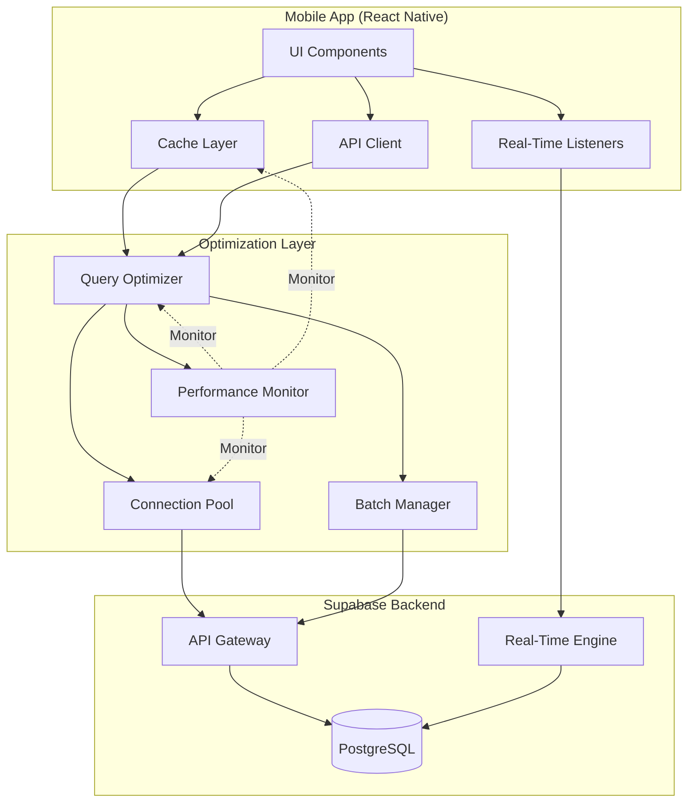

# Design Document: Database and Application Performance Tuning

## Overview

This design document outlines a comprehensive performance optimization strategy for the restaurant management system. The system uses Supabase (PostgreSQL) as the backend database with a React Native mobile application. Performance optimization focuses on three key areas:

1. **Database Layer**: Query optimization, indexing strategy, connection pooling, and PostgreSQL configuration
2. **Application Layer**: Caching, real-time listener optimization, batch operations, and code-level optimizations
3. **Monitoring Layer**: Performance metrics, alerting, and continuous optimization feedback

The design builds upon existing performance infrastructure (PerformanceMonitoringService, QueryOptimizerService, CacheLayerService) while adapting them from Firebase to Supabase and adding new optimization capabilities.

### Key Performance Goals

- Query response time < 100ms for 95th percentile
- Real-time update latency < 500ms
- Cache hit rate > 80% for frequently accessed data
- Support 50+ concurrent users without degradation
- Mobile app startup time < 2 seconds

## Architecture

### System Architecture Overview



### Data Flow Patterns

**Read Operations:**
1. Check application cache (L1)
2. If miss, query database through connection pool
3. Apply query optimizations (indexes, filters)
4. Cache result with appropriate TTL
5. Return to UI

**Write Operations:**
1. Validate data at application layer
2. Batch multiple operations when possible
3. Execute through connection pool with transaction
4. Invalidate affected cache entries
5. Trigger real-time updates to subscribed clients

**Real-Time Updates:**
1. Subscribe to filtered channels (company_id, date_key)
2. Receive only relevant updates
3. Debounce rapid updates (500ms)
4. Update local cache
5. Trigger UI re-render

## Components and Interfaces

### 1. Query Optimizer Service

**Purpose**: Analyze and optimize database queries for performance

**Interface:**
```typescript
interface QueryOptimizerService {
  // Analyze query performance
  analyzeQuery(sql: string): Promise<QueryAnalysis>;
  
  // Get optimized query with indexes
  optimizeQuery(query: QueryBuilder): QueryBuilder;
  
  // Detect N+1 query patterns
  detectN1Patterns(queries: Query[]): N1Pattern[];
  
  // Suggest indexes for query
  suggestIndexes(query: string): IndexSuggestion[];
  
  // Get query execution plan
  explainQuery(query: string): Promise<ExecutionPlan>;
}

interface QueryAnalysis {
  executionTime: number;
  rowsScanned: number;
  rowsReturned: number;
  indexesUsed: string[];
  suggestions: string[];
  severity: 'low' | 'medium' | 'high';
}

interface IndexSuggestion {
  table: string;
  columns: string[];
  type: 'btree' | 'gin' | 'gist';
  partial: boolean;
  whereClause?: string;
  estimatedImprovement: number;
}
```

**Key Methods:**

- `analyzeQuery()`: Executes EXPLAIN ANALYZE and parses results
- `optimizeQuery()`: Applies optimization rules (add filters, reorder joins, use indexes)
- `detectN1Patterns()`: Identifies queries executed in loops
- `suggestIndexes()`: Analyzes query patterns and suggests missing indexes

### 2. Connection Pool Manager

**Purpose**: Manage database connections efficiently

**Interface:**
```typescript
interface ConnectionPoolManager {
  // Get connection from pool
  getConnection(): Promise<Connection>;
  
  // Release connection back to pool
  releaseConnection(conn: Connection): void;
  
  // Execute query with automatic connection management
  executeQuery<T>(query: string, params: any[]): Promise<T>;
  
  // Get pool statistics
  getPoolStats(): PoolStats;
  
  // Configure pool settings
  configure(config: PoolConfig): void;
}

interface PoolConfig {
  minConnections: number;
  maxConnections: number;
  idleTimeout: number;
  connectionTimeout: number;
  retryAttempts: number;
  retryDelay: number;
}

interface PoolStats {
  active: number;
  idle: number;
  waiting: number;
  total: number;
  utilization: number;
}
```

**Configuration:**
- Min connections: 5
- Max connections: 20
- Idle timeout: 60 seconds
- Connection timeout: 5 seconds
- Exponential backoff for retries

### 3. Cache Layer Service (Enhanced)

**Purpose**: Intelligent multi-level caching with invalidation

**Interface:**
```typescript
interface CacheLayerService {
  // Get from cache
  get<T>(key: string): Promise<T | null>;
  
  // Set in cache with TTL
  set<T>(key: string, value: T, ttl?: number): Promise<void>;
  
  // Invalidate single key
  invalidate(key: string): Promise<void>;
  
  // Invalidate by pattern
  invalidatePattern(pattern: string): Promise<void>;
  
  // Wrap operation with cache
  withCache<T>(key: string, fetcher: () => Promise<T>, options?: CacheOptions): Promise<T>;
  
  // Get cache statistics
  getStats(): Promise<CacheStats>;
}

interface CacheOptions {
  ttl?: number;
  forceRefresh?: boolean;
  tags?: string[];
}

interface CacheStats {
  hits: number;
  misses: number;
  hitRate: number;
  size: number;
  entries: number;
}
```

**Cache Strategy:**
- Products: 5 minutes TTL
- Company settings: 10 minutes TTL
- User profiles: 3 minutes TTL
- Active orders: 30 seconds TTL
- Statistics: 5 minutes TTL

**Invalidation Strategy:**
- Tag-based invalidation (e.g., "orders:company123")
- Pattern matching for bulk invalidation
- Automatic invalidation on write operations

### 4. Real-Time Listener Manager

**Purpose**: Optimize Supabase real-time subscriptions

**Interface:**
```typescript
interface RealTimeListenerManager {
  // Subscribe to channel with filters
  subscribe(channel: string, filters: RealtimeFilter, callback: (payload: any) => void): Subscription;
  
  // Unsubscribe from channel
  unsubscribe(subscription: Subscription): void;
  
  // Get shared subscription
  getSharedSubscription(channel: string, filters: RealtimeFilter): Subscription;
  
  // Debounce updates
  debounceUpdates(callback: Function, delay: number): Function;
  
  // Get subscription stats
  getStats(): SubscriptionStats;
}

interface RealtimeFilter {
  table: string;
  event: 'INSERT' | 'UPDATE' | 'DELETE' | '*';
  filter?: string; // e.g., "company_id=eq.123"
}

interface SubscriptionStats {
  activeSubscriptions: number;
  messagesReceived: number;
  averageLatency: number;
  reconnections: number;
}
```

**Optimization Strategies:**
- Share subscriptions across components
- Filter at database level (company_id, date_key)
- Debounce rapid updates (500ms)
- Limit to 5 concurrent subscriptions per client
- Automatic cleanup on unmount

### 5. Batch Operation Manager

**Purpose**: Group multiple database operations into efficient batches

**Interface:**
```typescript
interface BatchOperationManager {
  // Add operation to batch
  addOperation(operation: Operation): void;
  
  // Execute batch
  executeBatch(): Promise<BatchResult>;
  
  // Execute with transaction
  executeTransaction(operations: Operation[]): Promise<BatchResult>;
  
  // Auto-flush when batch size reached
  setAutoFlush(enabled: boolean, maxSize: number): void;
}

interface Operation {
  type: 'insert' | 'update' | 'delete';
  table: string;
  data: any;
  where?: any;
}

interface BatchResult {
  success: boolean;
  affectedRows: number;
  errors: Error[];
  executionTime: number;
}
```

**Batch Rules:**
- Max 100 operations per batch
- Auto-flush after 1 second or when max size reached
- All operations in transaction for atomicity
- Rollback on any error

### 6. Performance Monitor Service (Enhanced)

**Purpose**: Monitor and alert on performance metrics

**Interface:**
```typescript
interface PerformanceMonitorService {
  // Track operation
  trackOperation<T>(name: string, operation: () => Promise<T>, metadata?: any): Promise<T>;
  
  // Log slow query
  logSlowQuery(query: string, executionTime: number, plan: any): void;
  
  // Get metrics summary
  getMetricsSummary(): MetricsSummary;
  
  // Get dashboard data
  getDashboardData(): DashboardData;
  
  // Alert on threshold breach
  alertOnThreshold(metric: string, threshold: number): void;
}

interface MetricsSummary {
  totalOperations: number;
  averageLatency: number;
  p95Latency: number;
  p99Latency: number;
  slowQueries: number;
  cacheHitRate: number;
  connectionPoolUtilization: number;
}
```

## Data Models

### Query Performance Log

```typescript
interface QueryPerformanceLog {
  id: string;
  query: string;
  executionTime: number;
  rowsScanned: number;
  rowsReturned: number;
  indexesUsed: string[];
  executionPlan: any;
  timestamp: Date;
  companyId: string;
  userId?: string;
}
```

### Index Metadata

```typescript
interface IndexMetadata {
  tableName: string;
  indexName: string;
  columns: string[];
  indexType: 'btree' | 'gin' | 'gist' | 'hash';
  isPartial: boolean;
  whereClause?: string;
  sizeBytes: number;
  scansCount: number;
  lastUsed?: Date;
  createdAt: Date;
}
```

### Cache Entry

```typescript
interface CacheEntry<T> {
  key: string;
  data: T;
  timestamp: number;
  ttl: number;
  compressed: boolean;
  tags: string[];
  hits: number;
  lastAccessed: Date;
}
```

### Performance Metric

```typescript
interface PerformanceMetric {
  id: string;
  metricType: 'query' | 'cache' | 'connection' | 'realtime';
  operationName: string;
  value: number;
  unit: 'ms' | 'count' | 'bytes' | 'percent';
  timestamp: Date;
  metadata: Record<string, any>;
}
```

## Database Schema Enhancements

### New Tables

**query_performance_logs** (for monitoring):
```sql
CREATE TABLE IF NOT EXISTS query_performance_logs (
  id UUID PRIMARY KEY DEFAULT uuid_generate_v4(),
  company_id UUID REFERENCES companies(id),
  query_hash TEXT NOT NULL,
  query_text TEXT,
  execution_time_ms INTEGER NOT NULL,
  rows_scanned INTEGER,
  rows_returned INTEGER,
  indexes_used TEXT[],
  execution_plan JSONB,
  created_at TIMESTAMPTZ DEFAULT NOW()
);

CREATE INDEX idx_query_perf_company_time ON query_performance_logs(company_id, created_at DESC);
CREATE INDEX idx_query_perf_slow ON query_performance_logs(execution_time_ms DESC) WHERE execution_time_ms > 100;
```

### Index Optimizations

**Composite Indexes:**
```sql
-- Orders: company + date (most common query pattern)
CREATE INDEX IF NOT EXISTS idx_orders_company_date 
  ON orders(company_id, date_key DESC);

-- Orders: company + status (for active orders)
CREATE INDEX IF NOT EXISTS idx_orders_company_status 
  ON orders(company_id, status) 
  WHERE status IN ('pending', 'preparing');

-- Orders: company + comanda
CREATE INDEX IF NOT EXISTS idx_orders_company_comanda 
  ON orders(company_id, comanda_number, date_key);
```

**Partial Indexes:**
```sql
-- Active orders only (reduces index size by 80%)
CREATE INDEX IF NOT EXISTS idx_orders_active 
  ON orders(company_id, created_at DESC)
  WHERE status IN ('pending', 'preparing');

-- Unpaid orders
CREATE INDEX IF NOT EXISTS idx_orders_unpaid 
  ON orders(company_id, comanda_number)
  WHERE is_paid = false;
```

**GIN Indexes for JSONB:**
```sql
-- Order items JSONB search
CREATE INDEX IF NOT EXISTS idx_orders_items_gin 
  ON orders USING GIN(items);

-- Daily statistics JSONB
CREATE INDEX IF NOT EXISTS idx_daily_stats_data_gin 
  ON daily_statistics USING GIN(orders_by_status);
```

### Table Partitioning

**Orders Table Partitioning (when > 100k rows):**
```sql
-- Convert to partitioned table
CREATE TABLE orders_partitioned (
  LIKE orders INCLUDING ALL
) PARTITION BY RANGE (date_key);

-- Create monthly partitions
CREATE TABLE orders_2024_01 PARTITION OF orders_partitioned
  FOR VALUES FROM ('2024-01-01') TO ('2024-02-01');

CREATE TABLE orders_2024_02 PARTITION OF orders_partitioned
  FOR VALUES FROM ('2024-02-01') TO ('2024-03-01');

-- Automatic partition creation function
CREATE OR REPLACE FUNCTION create_monthly_partition()
RETURNS void AS $
DECLARE
  partition_date DATE;
  partition_name TEXT;
  start_date TEXT;
  end_date TEXT;
BEGIN
  partition_date := DATE_TRUNC('month', CURRENT_DATE + INTERVAL '1 month');
  partition_name := 'orders_' || TO_CHAR(partition_date, 'YYYY_MM');
  start_date := partition_date::TEXT;
  end_date := (partition_date + INTERVAL '1 month')::TEXT;
  
  EXECUTE format(
    'CREATE TABLE IF NOT EXISTS %I PARTITION OF orders_partitioned FOR VALUES FROM (%L) TO (%L)',
    partition_name, start_date, end_date
  );
END;
$ LANGUAGE plpgsql;
```

## PostgreSQL Configuration Tuning

### Memory Settings

```sql
-- Shared buffers: 25% of RAM (for 4GB RAM = 1GB)
ALTER SYSTEM SET shared_buffers = '1GB';

-- Effective cache size: 75% of RAM (for 4GB RAM = 3GB)
ALTER SYSTEM SET effective_cache_size = '3GB';

-- Work mem: RAM / (max_connections * 2)
-- For 4GB RAM, 20 connections = 100MB
ALTER SYSTEM SET work_mem = '100MB';

-- Maintenance work mem: 10% of RAM
ALTER SYSTEM SET maintenance_work_mem = '400MB';
```

### Query Planning

```sql
-- Enable JIT compilation for complex queries
ALTER SYSTEM SET jit = on;

-- Random page cost (lower for SSD)
ALTER SYSTEM SET random_page_cost = 1.1;

-- Effective IO concurrency (for SSD)
ALTER SYSTEM SET effective_io_concurrency = 200;
```

### Connection Settings

```sql
-- Max connections
ALTER SYSTEM SET max_connections = 100;

-- Connection timeout
ALTER SYSTEM SET statement_timeout = '30s';

-- Idle in transaction timeout
ALTER SYSTEM SET idle_in_transaction_session_timeout = '60s';
```

### Checkpoint and WAL

```sql
-- Checkpoint completion target
ALTER SYSTEM SET checkpoint_completion_target = 0.9;

-- WAL buffers
ALTER SYSTEM SET wal_buffers = '16MB';

-- Max WAL size
ALTER SYSTEM SET max_wal_size = '2GB';
```

### Auto-vacuum

```sql
-- Enable auto-vacuum
ALTER SYSTEM SET autovacuum = on;

-- Auto-vacuum scale factor
ALTER SYSTEM SET autovacuum_vacuum_scale_factor = 0.1;

-- Auto-vacuum analyze scale factor
ALTER SYSTEM SET autovacuum_analyze_scale_factor = 0.05;
```

## Application-Level Optimizations

### React Native Performance

**1. List Virtualization:**
```typescript
// Use FlatList with optimization props
<FlatList
  data={orders}
  renderItem={renderOrderItem}
  keyExtractor={item => item.id}
  initialNumToRender={10}
  maxToRenderPerBatch={10}
  windowSize={5}
  removeClippedSubviews={true}
  getItemLayout={(data, index) => ({
    length: ITEM_HEIGHT,
    offset: ITEM_HEIGHT * index,
    index,
  })}
/>
```

**2. Memoization:**
```typescript
// Memoize expensive components
const OrderCard = React.memo(({ order }) => {
  // Component implementation
}, (prevProps, nextProps) => {
  return prevProps.order.id === nextProps.order.id &&
         prevProps.order.status === nextProps.order.status;
});

// Memoize expensive computations
const totalAmount = useMemo(() => {
  return orders.reduce((sum, order) => sum + order.total, 0);
}, [orders]);
```

**3. Request Deduplication:**
```typescript
class RequestDeduplicator {
  private pending: Map<string, Promise<any>> = new Map();
  
  async deduplicate<T>(key: string, fetcher: () => Promise<T>): Promise<T> {
    // If request is already pending, return existing promise
    if (this.pending.has(key)) {
      return this.pending.get(key)!;
    }
    
    // Start new request
    const promise = fetcher().finally(() => {
      this.pending.delete(key);
    });
    
    this.pending.set(key, promise);
    return promise;
  }
}
```

**4. Lazy Loading:**
```typescript
// Lazy load screens
const OrdersScreen = lazy(() => import('./screens/OrdersScreen'));
const StatisticsScreen = lazy(() => import('./screens/StatisticsScreen'));

// Lazy load images
<Image
  source={{ uri: product.imageUrl }}
  resizeMode="cover"
  loadingIndicatorSource={require('./assets/placeholder.png')}
/>
```

### Query Optimization Patterns

**1. Avoid N+1 Queries:**
```typescript
// BAD: N+1 query pattern
for (const order of orders) {
  const items = await getOrderItems(order.id); // N queries
}

// GOOD: Single query with join
const ordersWithItems = await supabase
  .from('orders')
  .select('*, order_items(*)')
  .eq('company_id', companyId);
```

**2. Use Appropriate Filters:**
```typescript
// BAD: Fetch all then filter in memory
const allOrders = await supabase.from('orders').select('*');
const activeOrders = allOrders.filter(o => o.status === 'pending');

// GOOD: Filter at database level
const activeOrders = await supabase
  .from('orders')
  .select('*')
  .eq('company_id', companyId)
  .in('status', ['pending', 'preparing'])
  .order('created_at', { ascending: false })
  .limit(50);
```

**3. Use Pagination:**
```typescript
// Cursor-based pagination
async function getOrdersPage(cursor?: string, pageSize: number = 50) {
  let query = supabase
    .from('orders')
    .select('*')
    .eq('company_id', companyId)
    .order('created_at', { ascending: false })
    .limit(pageSize);
  
  if (cursor) {
    query = query.lt('created_at', cursor);
  }
  
  const { data, error } = await query;
  
  return {
    items: data,
    nextCursor: data.length === pageSize ? data[data.length - 1].created_at : null,
    hasMore: data.length === pageSize
  };
}
```

### Real-Time Optimization

**1. Filtered Subscriptions:**
```typescript
// Subscribe with filters at database level
const subscription = supabase
  .channel('orders')
  .on(
    'postgres_changes',
    {
      event: '*',
      schema: 'public',
      table: 'orders',
      filter: `company_id=eq.${companyId} AND date_key=eq.${today}`
    },
    handleOrderChange
  )
  .subscribe();
```

**2. Debounced Updates:**
```typescript
const debouncedUpdate = useMemo(
  () => debounce((payload) => {
    // Update UI
    setOrders(prev => updateOrders(prev, payload));
  }, 500),
  []
);

// Use debounced handler
subscription.on('postgres_changes', debouncedUpdate);
```

**3. Shared Subscriptions:**
```typescript
class SubscriptionManager {
  private subscriptions: Map<string, Subscription> = new Map();
  
  getSharedSubscription(channel: string, filter: string) {
    const key = `${channel}:${filter}`;
    
    if (!this.subscriptions.has(key)) {
      const sub = supabase.channel(channel)
        .on('postgres_changes', { filter }, handleChange)
        .subscribe();
      
      this.subscriptions.set(key, sub);
    }
    
    return this.subscriptions.get(key)!;
  }
}
```

## Error Handling

### Query Timeout Handling

```typescript
async function executeWithTimeout<T>(
  operation: () => Promise<T>,
  timeoutMs: number = 5000
): Promise<T> {
  const timeoutPromise = new Promise<never>((_, reject) => {
    setTimeout(() => reject(new Error('Query timeout')), timeoutMs);
  });
  
  return Promise.race([operation(), timeoutPromise]);
}
```

### Connection Pool Exhaustion

```typescript
class ConnectionPoolError extends Error {
  constructor(message: string, public waitingCount: number) {
    super(message);
    this.name = 'ConnectionPoolError';
  }
}

async function getConnection(): Promise<Connection> {
  const stats = pool.getStats();
  
  if (stats.waiting > 10) {
    throw new ConnectionPoolError(
      'Connection pool exhausted',
      stats.waiting
    );
  }
  
  return pool.acquire();
}
```

### Cache Failure Fallback

```typescript
async function getCachedData<T>(
  key: string,
  fetcher: () => Promise<T>
): Promise<T> {
  try {
    const cached = await cache.get<T>(key);
    if (cached) return cached;
  } catch (error) {
    console.warn('Cache read failed, falling back to database', error);
  }
  
  const data = await fetcher();
  
  try {
    await cache.set(key, data);
  } catch (error) {
    console.warn('Cache write failed', error);
  }
  
  return data;
}
```

### Real-Time Reconnection

```typescript
class RealTimeManager {
  private reconnectAttempts = 0;
  private maxReconnectAttempts = 5;
  
  async handleDisconnect() {
    if (this.reconnectAttempts >= this.maxReconnectAttempts) {
      console.error('Max reconnection attempts reached');
      return;
    }
    
    const delay = Math.min(1000 * Math.pow(2, this.reconnectAttempts), 30000);
    this.reconnectAttempts++;
    
    await new Promise(resolve => setTimeout(resolve, delay));
    
    try {
      await this.reconnect();
      this.reconnectAttempts = 0;
    } catch (error) {
      console.error('Reconnection failed', error);
      await this.handleDisconnect();
    }
  }
}
```

## Testing Strategy

### Performance Testing Approach

The testing strategy combines unit tests for specific functionality with property-based tests for performance characteristics. Both types of tests are complementary and necessary for comprehensive coverage.

**Unit Tests** focus on:
- Specific optimization implementations
- Edge cases and error conditions
- Integration between components
- Configuration validation

**Property-Based Tests** focus on:
- Performance characteristics across many inputs
- Scalability under various loads
- Cache behavior with different access patterns
- Query optimization effectiveness

### Property-Based Testing Configuration

All property-based tests will use **fast-check** library for TypeScript/JavaScript and will run a minimum of 100 iterations per test to ensure comprehensive coverage through randomization.

Each property test must include a comment tag referencing its design document property:
```typescript
// Feature: database-performance-tuning, Property 1: Query execution time bounds
```

### Test Categories

1. **Query Performance Tests**
   - Unit: Test specific query optimizations
   - Property: Verify query time bounds across random data sets

2. **Cache Behavior Tests**
   - Unit: Test cache hit/miss scenarios
   - Property: Verify cache consistency and TTL behavior

3. **Connection Pool Tests**
   - Unit: Test pool configuration and lifecycle
   - Property: Verify pool behavior under concurrent load

4. **Real-Time Listener Tests**
   - Unit: Test subscription setup and cleanup
   - Property: Verify update delivery and debouncing

5. **Batch Operation Tests**
   - Unit: Test transaction rollback scenarios
   - Property: Verify atomicity across random operation sets

### Testing Tools

- **Jest**: Test runner and assertion library
- **fast-check**: Property-based testing library
- **@supabase/supabase-js**: Supabase client for integration tests
- **pg**: PostgreSQL client for direct database testing
- **React Native Testing Library**: Component testing

### Performance Benchmarks

Each test suite will establish baseline performance metrics:
- Query execution time: < 100ms (p95)
- Cache hit rate: > 80%
- Connection pool utilization: < 80%
- Real-time latency: < 500ms
- Batch operation throughput: > 100 ops/sec


## Correctness Properties

*A property is a characteristic or behavior that should hold true across all valid executions of a system—essentially, a formal statement about what the system should do. Properties serve as the bridge between human-readable specifications and machine-verifiable correctness guarantees.*

### Query Performance Properties

**Property 1: Slow query logging**
*For any* database query with execution time exceeding 100ms, the Query_Optimizer should log the query with performance metrics including execution time, rows scanned, and indexes used.
**Validates: Requirements 1.1, 11.1**

**Property 2: Query execution plan generation**
*For any* query being analyzed, the System should generate and store a query execution plan that can be retrieved for review.
**Validates: Requirements 1.2**

**Property 3: JSONB GIN index usage**
*For any* query that searches or filters JSONB fields, the Database should use GIN indexes in the execution plan.
**Validates: Requirements 1.4, 2.3**

**Property 4: Date range index usage**
*For any* query filtering by date ranges, the System should use date_key indexes as evidenced in the query execution plan.
**Validates: Requirements 1.5**

**Property 5: Prepared statement usage**
*For any* query executed more than 10 times, the System should use prepared statements for subsequent executions.
**Validates: Requirements 1.6**

**Property 6: Composite index usage for company and date**
*For any* query filtering by both company_id and date_key, the Database should use the composite index in the execution plan.
**Validates: Requirements 2.1**

**Property 7: Partial index usage for status filters**
*For any* query filtering by status values in ['pending', 'preparing'], the Database should use partial indexes in the execution plan.
**Validates: Requirements 2.2**

**Property 8: Full-text search GIN index usage**
*For any* full-text search query, the Database should use GIN indexes with tsvector in the execution plan.
**Validates: Requirements 2.4**

### Connection Pool Properties

**Property 9: Connection pool bounds**
*For any* point in time during system operation, the connection pool should maintain between 5 and 20 connections (inclusive).
**Validates: Requirements 3.1**

**Property 10: Exponential backoff for connection errors**
*For any* sequence of connection errors, the retry delays should follow an exponential backoff pattern (delay_n = min(base * 2^n, max_delay)).
**Validates: Requirements 3.4, 5.6**

**Property 11: Connection pool metrics tracking**
*For any* database operation, the System should update connection pool metrics (active, idle, waiting) to reflect the current state.
**Validates: Requirements 3.5, 11.3**

**Property 12: Connection pooling for all operations**
*For any* database operation (read or write), the System should acquire connections from the connection pool rather than creating new connections.
**Validates: Requirements 3.7**

### Cache Properties

**Property 13: Cache TTL enforcement**
*For any* cached data type (products, settings, profiles), the Cache_Layer should enforce the configured TTL (5min for products, 10min for settings, 3min for profiles) and return null for expired entries.
**Validates: Requirements 4.1, 4.2, 4.3**

**Property 14: Cache invalidation on updates**
*For any* cached data that is updated in the database, the System should invalidate the corresponding cache entry immediately.
**Validates: Requirements 4.4**

**Property 15: LRU eviction policy**
*For any* cache at capacity, when a new entry is added, the Cache_Layer should evict the least recently used entry first.
**Validates: Requirements 4.5**

**Property 16: Cache metrics tracking**
*For any* cache operation (get, set, invalidate), the System should update hit/miss metrics to reflect the operation outcome.
**Validates: Requirements 4.7, 11.2**

### Real-Time Listener Properties

**Property 17: Real-time subscription filtering**
*For any* order subscription, the Real_Time_Listener should include filters for company_id and date_key in the subscription configuration.
**Validates: Requirements 5.1**

**Property 18: Shared subscription deduplication**
*For any* set of subscription requests with identical channel and filter parameters, the System should create only one actual subscription and share it among requesters.
**Validates: Requirements 5.2**

**Property 19: Subscription cleanup on unmount**
*For any* screen or component that unmounts, the System should unsubscribe from all associated real-time listeners immediately.
**Validates: Requirements 5.3**

**Property 20: Real-time update debouncing**
*For any* sequence of real-time updates arriving within 500ms, the System should debounce them and trigger only one UI update after the delay.
**Validates: Requirements 5.4**

**Property 21: Subscription limit enforcement**
*For any* client, the System should enforce a maximum of 5 concurrent real-time subscriptions and reject or queue additional subscription requests.
**Validates: Requirements 5.5**

**Property 22: Real-time filter payload reduction**
*For any* real-time subscription with filters, the payload size should be smaller than an equivalent subscription without filters (when updates occur outside the filter criteria).
**Validates: Requirements 5.7**

**Property 23: Real-time subscription metrics**
*For any* real-time subscription operation, the System should track subscription counts and payload sizes in monitoring metrics.
**Validates: Requirements 11.4**

### Batch Operation Properties

**Property 24: Batch operation consolidation**
*For any* set of multiple operations of the same type (insert, update, or delete) on the same table, the System should consolidate them into a single batch operation.
**Validates: Requirements 6.1, 6.2, 6.3**

**Property 25: Batch transaction atomicity**
*For any* batch operation, all operations should execute within a single database transaction, ensuring all succeed or all fail together.
**Validates: Requirements 6.4**

**Property 26: Batch rollback on failure**
*For any* batch operation that encounters an error, the System should rollback all changes and report detailed error information for each failed operation.
**Validates: Requirements 6.5**

**Property 27: Batch size limit enforcement**
*For any* batch operation, the System should enforce a maximum of 100 operations per transaction and reject or split larger batches.
**Validates: Requirements 6.6**

**Property 28: Batch splitting for oversized operations**
*For any* batch operation exceeding 100 operations, the System should automatically split it into multiple batches of at most 100 operations each.
**Validates: Requirements 6.7**

### RLS Policy Properties

**Property 29: RLS helper function volatility**
*For any* helper function used in RLS policies, the function should be marked as STABLE or IMMUTABLE (not VOLATILE).
**Validates: Requirements 7.2**

**Property 30: RLS indexed column usage**
*For any* RLS policy filtering by company_id, the policy should use indexed columns in its WHERE clause.
**Validates: Requirements 7.3**

**Property 31: RLS policy performance**
*For any* query with RLS policies enabled, running EXPLAIN ANALYZE should show execution time within acceptable bounds (< 100ms for simple queries).
**Validates: Requirements 7.6**

### Partitioning Properties

**Property 32: Partition key usage in queries**
*For any* query on a partitioned table, the WHERE clause should include the partition key (date_key) to enable partition pruning.
**Validates: Requirements 8.2**

**Property 33: Monthly partition existence**
*For any* month within the retention period, the System should maintain a partition for orders and payments tables.
**Validates: Requirements 8.3**

**Property 34: Old partition handling**
*For any* partition older than 12 months, the System should either archive or drop it according to the configured retention policy.
**Validates: Requirements 8.5**

**Property 35: Partition-level indexes**
*For any* partition in a partitioned table, the partition should have its own set of indexes matching the parent table's index definitions.
**Validates: Requirements 8.6**

**Property 36: Partition pruning effectiveness**
*For any* query on a partitioned table with partition key filters, the execution plan should show partition pruning (scanning fewer partitions than total).
**Validates: Requirements 8.7**

### Pagination Properties

**Property 37: Cursor-based pagination implementation**
*For any* query returning more than 50 records, the System should use cursor-based pagination with indexed cursor keys and avoid OFFSET.
**Validates: Requirements 9.1, 9.3, 9.4, 9.7**

**Property 38: Page size limit enforcement**
*For any* pagination request, the System should return at most 50 records per page regardless of the requested size.
**Validates: Requirements 9.2**

**Property 39: Pagination cursor validation**
*For any* pagination request with a cursor, the System should validate the cursor integrity and reject invalid or tampered cursors.
**Validates: Requirements 9.5**

**Property 40: Count estimation without full scans**
*For any* request for total count on large tables, the System should return an estimate without performing a full table scan (using pg_class statistics).
**Validates: Requirements 9.6**

### Monitoring Properties

**Property 41: Performance degradation alerting**
*For any* query with established baseline performance, if execution time increases by more than 50%, the System should trigger a performance alert.
**Validates: Requirements 11.6**

**Property 42: Database resource monitoring**
*For any* monitoring interval, the System should collect and report database CPU and memory usage metrics.
**Validates: Requirements 11.5**

### Application Optimization Properties

**Property 43: List virtualization**
*For any* list rendering more than 20 items, the System should use virtualized list components (FlatList with windowSize and removeClippedSubviews).
**Validates: Requirements 12.1**

**Property 44: Request deduplication**
*For any* set of concurrent identical requests, the System should execute only one actual request and share the result among all requesters.
**Validates: Requirements 12.3**

**Property 45: Image caching and lazy loading**
*For any* image displayed in the UI, the System should implement caching and lazy loading to defer loading until the image is near the viewport.
**Validates: Requirements 12.5**

**Property 46: State update batching**
*For any* sequence of state updates occurring within a single event loop tick, the System should batch them into a single re-render.
**Validates: Requirements 12.7**
