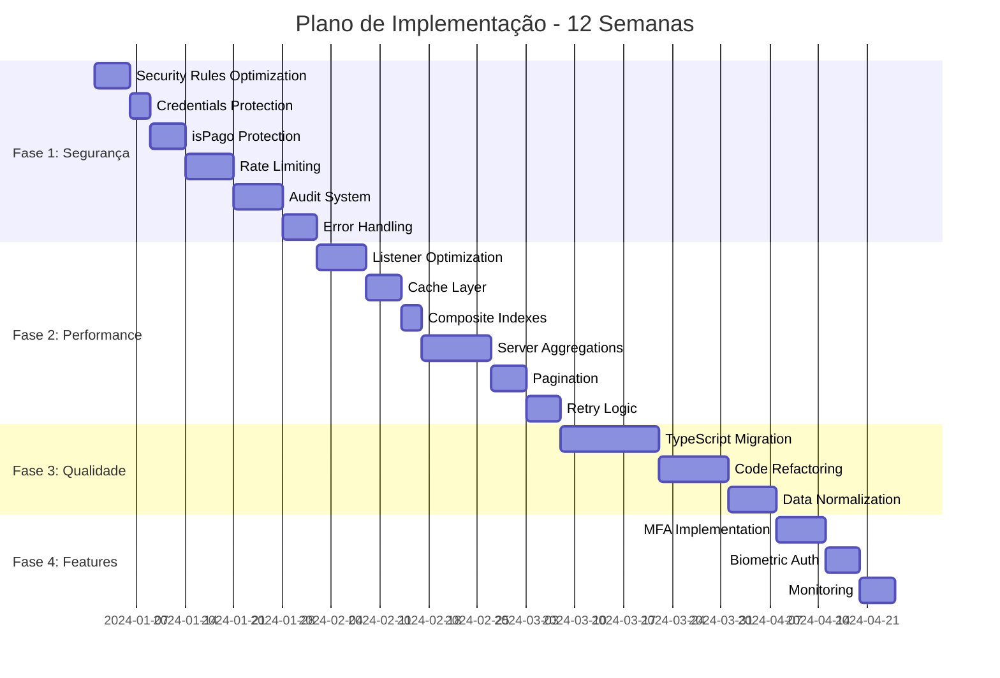

# Design Document - Modernização do Aplicativo de Restaurante

## Overview

Este documento detalha o design técnico para modernização do aplicativo de gestão de restaurante, transformando-o de uma solução MVP em um sistema enterprise-grade. A modernização aborda seis áreas críticas:

1. **Segurança**: Eliminação de vulnerabilidades, proteção de credenciais, implementação de MFA e auditoria
2. **Performance**: Redução de latência de operações críticas para <500ms através de otimização de queries, caching inteligente e listeners eficientes
3. **Custos**: Redução de 60%+ nos custos de Firestore através de agregações server-side, caching e eliminação de reads desnecessários
4. **Arquitetura de Dados**: Normalização da estrutura, eliminação de duplicações e implementação de arquivamento
5. **Qualidade de Código**: Migração completa para TypeScript, refatoração de lógica de negócio e cobertura de testes
6. **Operações**: Monitoramento, alertas e migração incremental sem downtime

O design prioriza mudanças incrementais que podem ser implementadas e validadas independentemente, minimizando riscos e permitindo rollback em cada fase.

## Architecture

### High-Level Architecture

```mermaid
graph TB
    subgraph "Client Layer"
        RN[React Native App]
        Cache[Local Cache<br/>AsyncStorage]
        Queue[Offline Queue]
    end
    
    subgraph "Firebase Services"
        Auth[Firebase Auth<br/>+ Custom Claims]
        Firestore[(Firestore<br/>Multi-tenant)]
        Functions[Cloud Functions]
    end
    
    subgraph "Data Layer"
        Active[Active Orders<br/>companies/{id}/orders]
        Archive[Archived Orders<br/>companies/{id}/archived]
        Stats[Statistics<br/>companies/{id}/statistics]
        Audit[Audit Logs<br/>audit/{id}]
    end
    
    RN -->|Auth + MFA| Auth
    RN -->|Queries| Firestore
    RN -->|Read Cache| Cache
    RN -->|Offline Ops| Queue
    
    Functions -->|Aggregations| Stats
    Functions -->|Archive Old| Archive
    Functions -->|Audit| Audit
    
    Firestore --> Active
    Firestore --> Archive
    Firestore --> Stats
```

### Security Architecture

**Custom Claims Strategy**: Elimina o problema de reads extras nas Security Rules movendo validação de tenant para o auth token.

```typescript
// Custom claims structure
interface CustomClaims {
  companyId: string;
  role: 'admin' | 'manager' | 'waiter' | 'kitchen';
  mfaEnabled: boolean;
  mfaVerified: boolean;
}
```

**Security Rules Optimization**:
```javascript
// ANTES (1 read extra por operação)
function doesUserBelongToCompany(companyId) {
  return exists(/databases/$(database)/documents/companies/$(companyId)/users/$(request.auth.uid));
}

// DEPOIS (0 reads extras)
function hasCompanyAccess(companyId) {
  return request.auth.token.companyId == companyId;
}
```

**Rate Limiting Architecture**: Implementado via Cloud Functions middleware que valida contadores em Firestore antes de processar operações.

### Data Architecture

**Collection Structure** (normalizada):
```
companies/{companyId}/
  ├── orders/{orderId}              # Pedidos ativos (últimos 90 dias)
  ├── archived/{orderId}            # Pedidos arquivados (>90 dias)
  ├── statistics/{dateKey}          # Estatísticas pré-computadas
  └── users/{userId}                # Usuários do tenant

audit/{auditId}                     # Logs de auditoria (global)
```

**Data Model** (TypeScript):
```typescript
interface Order {
  id: string;
  companyId: string;
  comandaNumber: string;           // Unificado (era numeroComanda/comandaNumber)
  dateKey: string;                 // YYYY-MM-DD (calculado server-side)
  status: 'pending' | 'preparing' | 'ready' | 'delivered' | 'cancelled';
  items: OrderItem[];
  totalAmount: number;
  isPago: boolean;                 // Protegido por Security Rules
  createdBy: string;               // Unificado (era criadoPor/createdBy)
  createdAt: Timestamp;
  updatedAt: Timestamp;
}

interface OrderItem {
  id: string;
  name: string;
  quantity: number;
  unitPrice: number;
  notes?: string;
}

interface DailyStatistics {
  companyId: string;
  dateKey: string;
  totalOrders: number;
  totalRevenue: number;
  averageOrderValue: number;
  ordersByStatus: Record<string, number>;
  topItems: Array<{itemId: string; quantity: number; revenue: number}>;
  updatedAt: Timestamp;
}
```

## Components and Interfaces

### 1. Auth Module (Enhanced)

**Responsibilities**:
- Autenticação com email/password, MFA e biometria
- Gerenciamento de custom claims
- Persistência segura de sessão
- Refresh de tokens

**Interface**:
```typescript
interface AuthService {
  // Authentication
  signIn(email: string, password: string): Promise<AuthResult>;
  signInWithBiometric(): Promise<AuthResult>;
  signOut(): Promise<void>;
  
  // MFA
  enableMFA(): Promise<MFASetupResult>;
  verifyMFA(code: string): Promise<boolean>;
  generateBackupCodes(): Promise<string[]>;
  
  // Session Management
  refreshCustomClaims(): Promise<void>;
  validateSession(): Promise<boolean>;
  
  // State
  getCurrentUser(): User | null;
  getCustomClaims(): CustomClaims | null;
}

interface AuthResult {
  user: User;
  requiresMFA: boolean;
  customClaims: CustomClaims;
}
```

**Implementation Notes**:
- Usa Expo SecureStore para persistência de tokens
- Implementa refresh automático de custom claims a cada 5 minutos
- Suporta Expo LocalAuthentication para biometria
- Integra com Firebase Auth para MFA via TOTP

### 2. Query Optimizer

**Responsibilities**:
- Gerenciamento de queries otimizadas com índices
- Cache de resultados
- Paginação cursor-based
- Monitoramento de performance

**Interface**:
```typescript
interface QueryOptimizer {
  // Optimized Queries
  getActiveOrders(companyId: string, limit?: number): Promise<Order[]>;
  getOrdersByComanda(companyId: string, comandaNumber: string): Promise<Order[]>;
  getOrdersByDateRange(companyId: string, startDate: string, endDate: string): Promise<Order[]>;
  
  // Pagination
  getOrdersPage(companyId: string, cursor?: string, pageSize?: number): Promise<PageResult<Order>>;
  
  // Cache Management
  invalidateCache(key: string): void;
  getCacheStats(): CacheStats;
}

interface PageResult<T> {
  items: T[];
  nextCursor?: string;
  hasMore: boolean;
}
```

**Optimization Strategies**:
- Composite indexes: `(companyId, dateKey, status, createdAt)`
- Query limits: máximo 100 resultados por query
- Cache TTL: 5 minutos para estatísticas, 30 segundos para pedidos ativos
- Memoization de conversões Firestore → TypeScript

### 3. Order Listener (Optimized)

**Responsibilities**:
- Monitoramento real-time de pedidos ativos
- Debouncing de updates
- Gerenciamento de subscriptions
- Detecção de mudanças eficiente

**Interface**:
```typescript
interface OrderListener {
  // Subscriptions
  subscribeToActiveOrders(
    companyId: string,
    callback: (orders: Order[]) => void
  ): UnsubscribeFunction;
  
  subscribeToOrder(
    orderId: string,
    callback: (order: Order) => void
  ): UnsubscribeFunction;
  
  // Lifecycle
  pauseAllListeners(): void;
  resumeAllListeners(): void;
  getActiveSubscriptions(): number;
}
```

**Implementation Details**:
- Debounce de 500ms para batch updates
- Máximo 5 listeners ativos por usuário
- Auto-unsubscribe após 5 minutos de inatividade
- Shallow comparison para detectar mudanças reais
- Query otimizada: `where('status', 'in', ['pending', 'preparing']).limit(100)`

### 4. Cache Layer

**Responsibilities**:
- Cache local com AsyncStorage
- Invalidação inteligente
- Background refresh
- Compressão de dados

**Interface**:
```typescript
interface CacheLayer {
  // Cache Operations
  get<T>(key: string): Promise<T | null>;
  set<T>(key: string, value: T, ttl?: number): Promise<void>;
  invalidate(key: string): Promise<void>;
  invalidatePattern(pattern: string): Promise<void>;
  
  // Statistics
  getHitRate(): number;
  getCacheSize(): Promise<number>;
  clear(): Promise<void>;
}
```

**Caching Strategy**:
- Statistics: TTL 5 minutos, background refresh
- Active orders: TTL 30 segundos, invalidação em mudanças
- User profile: TTL 1 hora, invalidação em updates
- Compression: JSON.stringify + LZ-string para dados grandes

### 5. Cloud Functions

**Functions Overview**:

```typescript
// 1. Aggregation Function (triggered on order write)
export const updateDailyStatistics = functions.firestore
  .document('companies/{companyId}/orders/{orderId}')
  .onWrite(async (change, context) => {
    // Atualiza estatísticas incrementalmente
    // Evita re-calcular todos os pedidos do dia
  });

// 2. Archival Function (scheduled daily)
export const archiveOldOrders = functions.pubsub
  .schedule('every day 03:00')
  .onRun(async (context) => {
    // Move pedidos >90 dias para archived collection
    // Processa em batches de 500
  });

// 3. Custom Claims Refresh (callable)
export const refreshUserClaims = functions.https
  .onCall(async (data, context) => {
    // Atualiza custom claims quando membership muda
    // Valida permissões antes de atualizar
  });

// 4. Rate Limiter Middleware
export const rateLimitMiddleware = async (
  req: functions.https.Request,
  res: functions.Response,
  next: () => void
) => {
  // Valida rate limits antes de processar
  // Retorna 429 se excedido
};

// 5. Audit Logger (triggered on sensitive operations)
export const auditLogger = functions.firestore
  .document('companies/{companyId}/orders/{orderId}')
  .onUpdate(async (change, context) => {
    // Loga mudanças em campos sensíveis (isPago)
    // Armazena em audit collection
  });
```

### 6. Migration Engine

**Responsibilities**:
- Migração incremental de dados
- Dual-write durante transição
- Validação de consistência
- Rollback capability

**Interface**:
```typescript
interface MigrationEngine {
  // Migration Phases
  startDualWrite(): Promise<void>;
  migrateDataBatch(batchSize: number): Promise<MigrationResult>;
  validateConsistency(): Promise<ValidationReport>;
  switchToNewStructure(): Promise<void>;
  rollback(): Promise<void>;
  
  // Monitoring
  getMigrationProgress(): MigrationProgress;
  getMigrationErrors(): MigrationError[];
}

interface MigrationResult {
  processed: number;
  succeeded: number;
  failed: number;
  errors: MigrationError[];
}
```

**Migration Phases**:
1. **Phase 1**: Deploy dual-write code (writes to both old and new structure)
2. **Phase 2**: Backfill existing data in batches
3. **Phase 3**: Validate consistency (automated tests)
4. **Phase 4**: Switch reads to new structure
5. **Phase 5**: Remove old structure (after 30 days)

## Data Models

### Order Model (Normalized)

```typescript
interface Order {
  // Identity
  id: string;
  companyId: string;
  
  // Order Info
  comandaNumber: string;           // Unificado
  tableNumber?: string;
  dateKey: string;                 // Server-calculated
  
  // Status
  status: OrderStatus;
  isPago: boolean;                 // Protected field
  
  // Items
  items: OrderItem[];
  
  // Amounts
  subtotal: number;
  tax: number;
  discount: number;
  totalAmount: number;
  
  // Metadata
  createdBy: string;               // Unificado
  createdAt: Timestamp;
  updatedAt: Timestamp;
  
  // Optional
  notes?: string;
  customerName?: string;
}

type OrderStatus = 
  | 'pending'      // Pedido criado, aguardando preparo
  | 'preparing'    // Em preparo na cozinha
  | 'ready'        // Pronto para entrega
  | 'delivered'    // Entregue ao cliente
  | 'cancelled';   // Cancelado

interface OrderItem {
  id: string;
  productId: string;
  name: string;
  quantity: number;
  unitPrice: number;
  subtotal: number;
  notes?: string;
  modifiers?: ItemModifier[];
}

interface ItemModifier {
  id: string;
  name: string;
  price: number;
}
```

### Statistics Model (Pre-computed)

```typescript
interface DailyStatistics {
  // Identity
  companyId: string;
  dateKey: string;                 // YYYY-MM-DD
  
  // Aggregated Metrics
  totalOrders: number;
  totalRevenue: number;
  averageOrderValue: number;
  
  // By Status
  ordersByStatus: {
    pending: number;
    preparing: number;
    ready: number;
    delivered: number;
    cancelled: number;
  };
  
  // By Payment
  paidOrders: number;
  unpaidOrders: number;
  
  // Top Performers
  topItems: TopItem[];
  topWaiters: TopWaiter[];
  
  // Hourly Distribution
  ordersByHour: Record<string, number>;  // "14": 25 (25 pedidos às 14h)
  
  // Metadata
  lastUpdated: Timestamp;
  version: number;                 // Para invalidação de cache
}

interface TopItem {
  productId: string;
  name: string;
  quantity: number;
  revenue: number;
}

interface TopWaiter {
  userId: string;
  name: string;
  ordersCount: number;
  totalRevenue: number;
}
```

### Audit Log Model

```typescript
interface AuditLog {
  // Identity
  id: string;
  companyId: string;
  
  // Event Info
  eventType: AuditEventType;
  resourceType: 'order' | 'user' | 'product' | 'company';
  resourceId: string;
  
  // Actor
  userId: string;
  userEmail: string;
  userRole: string;
  
  // Changes
  before?: Record<string, any>;
  after?: Record<string, any>;
  changes?: FieldChange[];
  
  // Context
  ipAddress?: string;
  userAgent?: string;
  
  // Metadata
  timestamp: Timestamp;
}

type AuditEventType =
  | 'auth.login'
  | 'auth.logout'
  | 'auth.failed_login'
  | 'auth.mfa_enabled'
  | 'order.created'
  | 'order.updated'
  | 'order.deleted'
  | 'order.payment_changed'
  | 'user.created'
  | 'user.role_changed'
  | 'permission.denied';

interface FieldChange {
  field: string;
  oldValue: any;
  newValue: any;
}
```


## Correctness Properties

*Uma propriedade é uma característica ou comportamento que deve ser verdadeiro em todas as execuções válidas de um sistema - essencialmente, uma declaração formal sobre o que o sistema deve fazer. Propriedades servem como ponte entre especificações legíveis por humanos e garantias de correção verificáveis por máquina.*

### Property Reflection

Após análise dos 150 acceptance criteria, identifiquei 60 critérios potencialmente testáveis. Após reflexão para eliminar redundâncias:

**Redundâncias Identificadas**:
- Propriedades 4.1 e 4.2 (rate limiting de writes e reads) podem ser combinadas em uma propriedade genérica de rate limiting
- Propriedades 6.2 e 11.1 (memoization em diferentes contextos) são essencialmente a mesma propriedade aplicada a diferentes componentes
- Propriedades 20.1, 20.2 e 20.3 (audit logging de diferentes tipos de operações) podem ser combinadas em uma propriedade genérica de audit logging
- Propriedades 7.2 e 12.4 (caching em diferentes contextos) compartilham a mesma lógica fundamental

**Propriedades Consolidadas**: Após eliminação de redundâncias, mantemos 45 propriedades únicas que fornecem valor de validação distinto.

### Core Properties

#### Property 1: Custom Claims Completeness
*Para qualquer* usuário autenticado, os custom claims devem conter os campos obrigatórios companyId e role.
**Validates: Requirements 1.4**

#### Property 2: Configuration Validation
*Para qualquer* tentativa de acesso a configuração sensível, se variáveis de ambiente obrigatórias estiverem ausentes, o sistema deve lançar erro específico de configuração.
**Validates: Requirements 2.4**

#### Property 3: Payment Change Audit Trail
*Para qualquer* mudança no campo isPago de um pedido, o sistema deve criar um registro de auditoria correspondente com usuário, timestamp e valor anterior.
**Validates: Requirements 3.2**

#### Property 4: Payment Record Immutability
*Para qualquer* pedido marcado como pago (isPago = true), o sistema deve criar um registro de pagamento imutável em collection separada.
**Validates: Requirements 3.4**

#### Property 5: Rate Limiting Enforcement
*Para qualquer* usuário, quando o número de operações (reads ou writes) exceder o limite configurado por minuto, o sistema deve retornar erro com código apropriado e não processar a operação.
**Validates: Requirements 4.1, 4.2**

#### Property 6: Exponential Backoff on Rate Limit Violations
*Para qualquer* usuário com violações repetidas de rate limit, o tempo de bloqueio deve aumentar exponencialmente com cada violação subsequente.
**Validates: Requirements 4.4**

#### Property 7: Authentication State Persistence
*Para qualquer* usuário autenticado, após reinicialização da aplicação, o estado de autenticação deve ser restaurado sem necessidade de novo login (dentro do período de validade da sessão).
**Validates: Requirements 5.2**

#### Property 8: Session Timeout Enforcement
*Para qualquer* usuário inativo por mais de 30 dias, a sessão deve expirar e requerer nova autenticação.
**Validates: Requirements 5.3**

#### Property 9: Auth State Validation Before Persistence
*Para qualquer* mudança de estado de autenticação, apenas estados válidos (com token válido e claims completos) devem ser persistidos.
**Validates: Requirements 5.4**

#### Property 10: Listener Debouncing
*Para qualquer* sequência de mudanças em dados do Firestore, o Order_Listener deve agrupar atualizações que ocorrem dentro de 500ms em uma única atualização de estado.
**Validates: Requirements 6.1, 6.3**

#### Property 11: Memoization Prevents Reprocessing
*Para qualquer* dado idêntico processado múltiplas vezes, o sistema deve retornar resultado memoizado sem re-executar a transformação.
**Validates: Requirements 6.2, 11.1**

#### Property 12: Listener Subscription Limit
*Para qualquer* usuário, o sistema deve permitir no máximo 5 listeners ativos simultaneamente e rejeitar tentativas de criar listeners adicionais.
**Validates: Requirements 6.4**

#### Property 13: Automatic Listener Cleanup
*Para qualquer* listener inativo por mais de 5 minutos, o sistema deve automaticamente cancelar a subscription para liberar recursos.
**Validates: Requirements 6.5**

#### Property 14: Cache Hit Prevents Query
*Para qualquer* query com dados válidos em cache (dentro do TTL), o sistema deve retornar dados do cache sem executar query ao Firestore.
**Validates: Requirements 7.2**

#### Property 15: Cache Invalidation on Data Change
*Para qualquer* mudança em dados, todas as entradas de cache relacionadas devem ser invalidadas para garantir consistência.
**Validates: Requirements 7.3**

#### Property 16: Active Orders Query Filtering
*Para qualquer* query de pedidos ativos, apenas pedidos com status 'pending' ou 'preparing' devem ser retornados.
**Validates: Requirements 9.1**

#### Property 17: Query Result Limit
*Para qualquer* query de pedidos ativos, o número máximo de resultados retornados deve ser 100.
**Validates: Requirements 9.4**

#### Property 18: Comanda Number Normalization
*Para qualquer* número de comanda no sistema, ele deve seguir formato normalizado consistente (sem variações de numeroComanda vs comandaNumber).
**Validates: Requirements 10.3**

#### Property 19: Query Failure Returns Empty Result
*Para qualquer* query que falhe por erro não-crítico, o sistema deve retornar resultado vazio ao invés de propagar exceção.
**Validates: Requirements 10.4**

#### Property 20: Shallow Comparison Detects Changes
*Para qualquer* documento do Firestore convertido múltiplas vezes, apenas campos que realmente mudaram devem ser re-processados.
**Validates: Requirements 11.2, 11.3**

#### Property 21: Pagination Threshold
*Para qualquer* lista com mais de 50 itens, o sistema deve usar paginação cursor-based ao invés de carregar todos os itens.
**Validates: Requirements 12.1**

#### Property 22: Page Size Limit
*Para qualquer* página de resultados paginados, o número máximo de itens deve ser 50.
**Validates: Requirements 12.2**

#### Property 23: Paginated Results Caching
*Para qualquer* página de resultados já carregada, navegação de volta para essa página deve usar cache ao invés de re-query.
**Validates: Requirements 12.4**

#### Property 24: Sorted Insertion Maintains Order
*Para qualquer* novo item adicionado a lista paginada, ele deve ser inserido na posição correta mantendo a ordenação sem invalidar cache completo.
**Validates: Requirements 12.5**

#### Property 25: Consistent Path Pattern
*Para qualquer* acesso a dados de pedidos, o path usado deve seguir o padrão consistente companies/{companyId}/orders/{orderId}.
**Validates: Requirements 13.3**

#### Property 26: DateKey Format Validation
*Para qualquer* dateKey no sistema, ele deve corresponder ao padrão YYYY-MM-DD.
**Validates: Requirements 14.4**

#### Property 27: Local Date to UTC Conversion
*Para qualquer* query por data usando data local do usuário, a conversão para UTC deve ser aplicada para garantir resultados consistentes.
**Validates: Requirements 14.5**

#### Property 28: Retry on Retryable Errors
*Para qualquer* transação que falhe com erro retryable (network, timeout, contention), o sistema deve tentar novamente até 3 vezes com exponential backoff.
**Validates: Requirements 16.1**

#### Property 29: Error Classification
*Para qualquer* erro capturado, ele deve ser classificado corretamente como retryable (network, timeout) ou non-retryable (permission, validation).
**Validates: Requirements 16.2**

#### Property 30: Retry Exhaustion Logging
*Para qualquer* operação que exceda o número máximo de retries, o sistema deve logar a falha com contexto completo.
**Validates: Requirements 16.3**

#### Property 31: Idempotency Key Deduplication
*Para qualquer* operação com idempotency key, múltiplas execuções com a mesma key devem resultar em apenas uma operação efetiva.
**Validates: Requirements 16.4**

#### Property 32: Offline Operation Queueing
*Para qualquer* operação executada enquanto offline, ela deve ser adicionada à fila de sincronização para retry quando conexão for restaurada.
**Validates: Requirements 16.5**

#### Property 33: Unified Archive Query
*Para qualquer* query de pedidos por período que abranja dados arquivados, o sistema deve buscar transparentemente em ambas as collections (active e archived).
**Validates: Requirements 17.4**

#### Property 34: MFA Requirement for Privileged Roles
*Para qualquer* usuário com role 'admin' ou 'manager', MFA deve ser obrigatório para autenticação.
**Validates: Requirements 18.2**

#### Property 35: MFA Backup Codes Generation
*Para qualquer* usuário que habilite MFA, o sistema deve gerar códigos de backup para recuperação de conta.
**Validates: Requirements 18.4**

#### Property 36: Account Lockout After Failed MFA
*Para qualquer* usuário que falhe verificação MFA 5 vezes consecutivas, a conta deve ser temporariamente bloqueada.
**Validates: Requirements 18.5**

#### Property 37: Biometric Fallback to Password
*Para qualquer* tentativa de autenticação biométrica que falhe, o sistema deve permitir fallback para autenticação por senha.
**Validates: Requirements 19.3**

#### Property 38: Token Validation After Biometric Auth
*Para qualquer* autenticação biométrica bem-sucedida, o sistema deve validar que o token de sessão ainda é válido antes de conceder acesso.
**Validates: Requirements 19.5**

#### Property 39: Write Operations Audit Logging
*Para qualquer* operação de escrita (create, update, delete) em collections críticas, um registro de auditoria deve ser criado com usuário, timestamp, tipo de operação e documentos afetados.
**Validates: Requirements 20.1, 20.2, 20.3**

#### Property 40: Statistics Query Uses Aggregations
*Para qualquer* query de estatísticas, o sistema deve buscar dados da collection de agregações pré-computadas ao invés de calcular a partir de pedidos individuais.
**Validates: Requirements 21.3**

#### Property 41: Centralized Error Handling
*Para qualquer* erro lançado no sistema, ele deve ser uma instância de classe de erro customizada (não Error genérico).
**Validates: Requirements 24.1**

#### Property 42: Error Categorization
*Para qualquer* erro capturado, ele deve ser categorizado como 'user_error', 'system_error' ou 'network_error'.
**Validates: Requirements 24.2**

#### Property 43: Error Logging Completeness
*Para qualquer* erro logado, o log deve incluir stack trace, contexto da operação e informações do usuário.
**Validates: Requirements 24.4**

### Edge Cases

As seguintes propriedades representam casos extremos importantes que devem ser tratados:

#### Edge Case 1: Empty Configuration
*Para qualquer* inicialização do sistema com configuração vazia ou inválida, o sistema deve falhar gracefully com mensagem clara.
**Validates: Requirements 2.5**

#### Edge Case 2: Rate Limit Exactly at Threshold
*Para qualquer* usuário que execute exatamente o número limite de operações, a última operação deve ser bem-sucedida e a próxima deve ser rejeitada.
**Validates: Requirements 4.3**

#### Edge Case 3: Empty Active Orders List
*Para qualquer* query de pedidos ativos quando não existem pedidos, o sistema deve retornar lista vazia sem executar query desnecessária.
**Validates: Requirements 9.5**

#### Edge Case 4: Pagination at Exact Boundary
*Para qualquer* lista com exatamente 50 itens, o sistema deve usar paginação (não assumir que é pequena o suficiente para carregar tudo).
**Validates: Requirements 12.1**

#### Edge Case 5: Single Retry Success
*Para qualquer* operação que falhe na primeira tentativa mas suceda no primeiro retry, apenas uma operação efetiva deve ser executada (idempotência).
**Validates: Requirements 16.4**


## Error Handling

### Error Classification System

O sistema implementa hierarquia de erros customizados para tratamento consistente:

```typescript
// Base Error Class
abstract class AppError extends Error {
  constructor(
    message: string,
    public code: string,
    public category: 'user_error' | 'system_error' | 'network_error',
    public retryable: boolean,
    public context?: Record<string, any>
  ) {
    super(message);
    this.name = this.constructor.name;
  }
}

// User Errors (não retryable)
class ValidationError extends AppError {
  constructor(message: string, context?: Record<string, any>) {
    super(message, 'VALIDATION_ERROR', 'user_error', false, context);
  }
}

class AuthenticationError extends AppError {
  constructor(message: string, context?: Record<string, any>) {
    super(message, 'AUTH_ERROR', 'user_error', false, context);
  }
}

class PermissionError extends AppError {
  constructor(message: string, context?: Record<string, any>) {
    super(message, 'PERMISSION_ERROR', 'user_error', false, context);
  }
}

// Network Errors (retryable)
class NetworkError extends AppError {
  constructor(message: string, context?: Record<string, any>) {
    super(message, 'NETWORK_ERROR', 'network_error', true, context);
  }
}

class TimeoutError extends AppError {
  constructor(message: string, context?: Record<string, any>) {
    super(message, 'TIMEOUT_ERROR', 'network_error', true, context);
  }
}

// System Errors (alguns retryable)
class DatabaseError extends AppError {
  constructor(message: string, retryable: boolean, context?: Record<string, any>) {
    super(message, 'DATABASE_ERROR', 'system_error', retryable, context);
  }
}

class ConfigurationError extends AppError {
  constructor(message: string, context?: Record<string, any>) {
    super(message, 'CONFIG_ERROR', 'system_error', false, context);
  }
}

class RateLimitError extends AppError {
  constructor(message: string, public retryAfter: number, context?: Record<string, any>) {
    super(message, 'RATE_LIMIT_ERROR', 'system_error', true, context);
  }
}
```

### Error Handling Strategy

**Retry Logic**:
```typescript
async function withRetry<T>(
  operation: () => Promise<T>,
  options: {
    maxRetries: number;
    backoffMs: number;
    idempotencyKey?: string;
  }
): Promise<T> {
  let lastError: Error;
  
  for (let attempt = 0; attempt <= options.maxRetries; attempt++) {
    try {
      return await operation();
    } catch (error) {
      lastError = error;
      
      // Não retry se erro não é retryable
      if (error instanceof AppError && !error.retryable) {
        throw error;
      }
      
      // Não retry se atingiu máximo
      if (attempt === options.maxRetries) {
        break;
      }
      
      // Exponential backoff
      const delay = options.backoffMs * Math.pow(2, attempt);
      await sleep(delay);
    }
  }
  
  // Log falha após todos os retries
  logger.error('Operation failed after max retries', {
    error: lastError,
    maxRetries: options.maxRetries,
    idempotencyKey: options.idempotencyKey
  });
  
  throw lastError;
}
```

**Global Error Handler**:
```typescript
function handleError(error: Error, context: ErrorContext): void {
  // Classifica erro se não for AppError
  const appError = error instanceof AppError 
    ? error 
    : new DatabaseError(error.message, false, { originalError: error });
  
  // Log com contexto completo
  logger.error(appError.message, {
    code: appError.code,
    category: appError.category,
    retryable: appError.retryable,
    stack: appError.stack,
    context: { ...appError.context, ...context },
    user: getCurrentUser()
  });
  
  // Envia para monitoring service
  if (process.env.NODE_ENV === 'production') {
    Sentry.captureException(appError, {
      tags: {
        category: appError.category,
        code: appError.code
      },
      extra: appError.context
    });
  }
  
  // Retorna mensagem user-friendly em português
  const userMessage = getUserFriendlyMessage(appError);
  showErrorToUser(userMessage);
}

function getUserFriendlyMessage(error: AppError): string {
  const messages: Record<string, string> = {
    'VALIDATION_ERROR': 'Os dados fornecidos são inválidos. Por favor, verifique e tente novamente.',
    'AUTH_ERROR': 'Falha na autenticação. Por favor, faça login novamente.',
    'PERMISSION_ERROR': 'Você não tem permissão para realizar esta operação.',
    'NETWORK_ERROR': 'Erro de conexão. Verifique sua internet e tente novamente.',
    'TIMEOUT_ERROR': 'A operação demorou muito. Por favor, tente novamente.',
    'DATABASE_ERROR': 'Erro ao acessar dados. Por favor, tente novamente.',
    'CONFIG_ERROR': 'Erro de configuração do aplicativo. Contate o suporte.',
    'RATE_LIMIT_ERROR': 'Muitas requisições. Por favor, aguarde um momento.'
  };
  
  return messages[error.code] || 'Ocorreu um erro inesperado. Por favor, tente novamente.';
}
```

### Offline Error Handling

```typescript
class OfflineQueue {
  private queue: QueuedOperation[] = [];
  
  async enqueue(operation: QueuedOperation): Promise<void> {
    this.queue.push(operation);
    await this.persistQueue();
  }
  
  async processQueue(): Promise<void> {
    while (this.queue.length > 0 && isOnline()) {
      const operation = this.queue[0];
      
      try {
        await withRetry(
          () => operation.execute(),
          {
            maxRetries: 3,
            backoffMs: 1000,
            idempotencyKey: operation.idempotencyKey
          }
        );
        
        // Remove da fila após sucesso
        this.queue.shift();
        await this.persistQueue();
        
      } catch (error) {
        // Se erro não é retryable, remove da fila
        if (error instanceof AppError && !error.retryable) {
          this.queue.shift();
          await this.persistQueue();
          
          logger.error('Removed non-retryable operation from queue', {
            operation: operation.type,
            error
          });
        } else {
          // Mantém na fila para próxima tentativa
          break;
        }
      }
    }
  }
}
```

## Testing Strategy

### Dual Testing Approach

O sistema utiliza abordagem complementar de testes:

**Unit Tests**: Validam exemplos específicos, casos extremos e condições de erro
**Property Tests**: Validam propriedades universais através de múltiplos inputs gerados

Ambos são necessários para cobertura abrangente - unit tests capturam bugs concretos, property tests verificam correção geral.

### Property-Based Testing Configuration

**Framework**: fast-check (JavaScript/TypeScript property-based testing library)

**Configuração Padrão**:
```typescript
import fc from 'fast-check';

// Configuração global para todos os property tests
const propertyTestConfig = {
  numRuns: 100,              // Mínimo 100 iterações por teste
  verbose: true,             // Log detalhado de falhas
  seed: Date.now(),          // Seed para reproduzibilidade
  endOnFailure: false        // Continua após primeira falha para encontrar mais casos
};

// Exemplo de property test
describe('Feature: restaurant-app-modernization, Property 1: Custom Claims Completeness', () => {
  it('should include companyId and role in custom claims for all authenticated users', () => {
    fc.assert(
      fc.property(
        fc.record({
          uid: fc.uuid(),
          email: fc.emailAddress(),
          companyId: fc.uuid(),
          role: fc.constantFrom('admin', 'manager', 'waiter', 'kitchen')
        }),
        async (userData) => {
          // Autentica usuário
          const user = await authService.signIn(userData.email, 'password');
          
          // Valida custom claims
          const claims = await authService.getCustomClaims();
          
          expect(claims).toBeDefined();
          expect(claims.companyId).toBe(userData.companyId);
          expect(claims.role).toBe(userData.role);
        }
      ),
      propertyTestConfig
    );
  });
});
```

### Test Organization

```
tests/
├── unit/                           # Unit tests
│   ├── services/
│   │   ├── auth.test.ts
│   │   ├── orders.test.ts
│   │   └── cache.test.ts
│   ├── utils/
│   │   ├── validation.test.ts
│   │   └── conversion.test.ts
│   └── components/
│       └── OrderList.test.tsx
│
├── property/                       # Property-based tests
│   ├── auth-properties.test.ts
│   ├── cache-properties.test.ts
│   ├── pagination-properties.test.ts
│   ├── retry-properties.test.ts
│   └── audit-properties.test.ts
│
├── integration/                    # Integration tests
│   ├── order-flow.test.ts
│   ├── payment-flow.test.ts
│   └── auth-flow.test.ts
│
└── e2e/                           # End-to-end tests
    ├── create-order.test.ts
    └── manage-orders.test.ts
```

### Property Test Examples

**Property 5: Rate Limiting Enforcement**
```typescript
describe('Feature: restaurant-app-modernization, Property 5: Rate Limiting Enforcement', () => {
  it('should reject operations when rate limit is exceeded', () => {
    fc.assert(
      fc.property(
        fc.record({
          userId: fc.uuid(),
          operationType: fc.constantFrom('read', 'write'),
          operationCount: fc.integer({ min: 101, max: 200 })
        }),
        async ({ userId, operationType, operationCount }) => {
          const rateLimiter = new RateLimiter();
          const limit = operationType === 'read' ? 500 : 100;
          
          // Executa operações até exceder limite
          let rejectedCount = 0;
          for (let i = 0; i < operationCount; i++) {
            try {
              await rateLimiter.checkLimit(userId, operationType);
            } catch (error) {
              if (error instanceof RateLimitError) {
                rejectedCount++;
              }
            }
          }
          
          // Valida que operações acima do limite foram rejeitadas
          expect(rejectedCount).toBeGreaterThan(0);
          expect(rejectedCount).toBe(operationCount - limit);
        }
      ),
      propertyTestConfig
    );
  });
});
```

**Property 11: Memoization Prevents Reprocessing**
```typescript
describe('Feature: restaurant-app-modernization, Property 11: Memoization Prevents Reprocessing', () => {
  it('should return memoized result for identical data without reprocessing', () => {
    fc.assert(
      fc.property(
        fc.array(fc.record({
          id: fc.uuid(),
          name: fc.string(),
          quantity: fc.integer({ min: 1, max: 100 }),
          price: fc.float({ min: 0.01, max: 1000 })
        })),
        (orderItems) => {
          const converter = new MemoizedConverter();
          let processingCount = 0;
          
          // Mock para contar processamentos
          const originalTransform = converter.transform;
          converter.transform = function(...args) {
            processingCount++;
            return originalTransform.apply(this, args);
          };
          
          // Processa mesmos dados múltiplas vezes
          const result1 = converter.convertOrderItems(orderItems);
          const result2 = converter.convertOrderItems(orderItems);
          const result3 = converter.convertOrderItems(orderItems);
          
          // Valida que processamento ocorreu apenas uma vez
          expect(processingCount).toBe(1);
          expect(result1).toEqual(result2);
          expect(result2).toEqual(result3);
        }
      ),
      propertyTestConfig
    );
  });
});
```

**Property 31: Idempotency Key Deduplication**
```typescript
describe('Feature: restaurant-app-modernization, Property 31: Idempotency Key Deduplication', () => {
  it('should execute operation only once for multiple requests with same idempotency key', () => {
    fc.assert(
      fc.property(
        fc.record({
          idempotencyKey: fc.uuid(),
          orderData: fc.record({
            comandaNumber: fc.string(),
            items: fc.array(fc.record({
              name: fc.string(),
              quantity: fc.integer({ min: 1, max: 10 })
            }))
          }),
          requestCount: fc.integer({ min: 2, max: 5 })
        }),
        async ({ idempotencyKey, orderData, requestCount }) => {
          const orderService = new OrderService();
          const results: string[] = [];
          
          // Executa mesma operação múltiplas vezes com mesma key
          for (let i = 0; i < requestCount; i++) {
            const orderId = await orderService.createOrder(
              orderData,
              { idempotencyKey }
            );
            results.push(orderId);
          }
          
          // Valida que todos retornaram mesmo orderId
          const uniqueIds = new Set(results);
          expect(uniqueIds.size).toBe(1);
          
          // Valida que apenas um pedido foi criado
          const orders = await orderService.getOrdersByIdempotencyKey(idempotencyKey);
          expect(orders.length).toBe(1);
        }
      ),
      propertyTestConfig
    );
  });
});
```

### Unit Test Balance

Unit tests devem focar em:
- **Exemplos específicos**: Casos de uso comuns e fluxos principais
- **Casos extremos**: Valores limites, listas vazias, dados inválidos
- **Condições de erro**: Validação de tratamento de erros específicos
- **Integração entre componentes**: Pontos de integração críticos

**Evitar**: Muitos unit tests para variações de inputs - property tests cobrem isso melhor.

**Exemplo de Unit Test Apropriado**:
```typescript
describe('OrderService', () => {
  describe('createOrder', () => {
    it('should create order with valid data', async () => {
      const orderData = {
        comandaNumber: 'C001',
        items: [{ name: 'Pizza', quantity: 2, unitPrice: 25.00 }]
      };
      
      const orderId = await orderService.createOrder(orderData);
      
      expect(orderId).toBeDefined();
      const order = await orderService.getOrder(orderId);
      expect(order.comandaNumber).toBe('C001');
      expect(order.totalAmount).toBe(50.00);
    });
    
    it('should reject order with empty items', async () => {
      const orderData = {
        comandaNumber: 'C002',
        items: []
      };
      
      await expect(orderService.createOrder(orderData))
        .rejects
        .toThrow(ValidationError);
    });
    
    it('should handle network timeout gracefully', async () => {
      // Mock network timeout
      jest.spyOn(firestore, 'collection').mockImplementation(() => {
        throw new TimeoutError('Request timeout');
      });
      
      await expect(orderService.createOrder(validOrderData))
        .rejects
        .toThrow(TimeoutError);
    });
  });
});
```

### Test Coverage Requirements

- **Mínimo 80% de cobertura** para módulos de lógica de negócio
- **100% de cobertura** para funções críticas de segurança (auth, permissions, audit)
- **Todas as propriedades do design** devem ter property test correspondente
- **Todos os casos extremos identificados** devem ter unit test específico

### CI/CD Integration

```yaml
# .github/workflows/test.yml
name: Tests

on: [push, pull_request]

jobs:
  test:
    runs-on: ubuntu-latest
    
    steps:
      - uses: actions/checkout@v2
      
      - name: Setup Node.js
        uses: actions/setup-node@v2
        with:
          node-version: '18'
      
      - name: Install dependencies
        run: npm ci
      
      - name: Run TypeScript compilation
        run: npm run type-check
      
      - name: Run unit tests
        run: npm run test:unit
      
      - name: Run property tests
        run: npm run test:property
      
      - name: Run integration tests
        run: npm run test:integration
      
      - name: Check coverage
        run: npm run test:coverage
      
      - name: Upload coverage to Codecov
        uses: codecov/codecov-action@v2
        with:
          files: ./coverage/coverage-final.json
          fail_ci_if_error: true
          flags: unittests
          name: codecov-umbrella
```

### Performance Testing

Além de testes funcionais, o sistema deve incluir testes de performance:

```typescript
describe('Performance Tests', () => {
  it('should load active orders in less than 500ms', async () => {
    const startTime = Date.now();
    
    const orders = await orderService.getActiveOrders(companyId);
    
    const duration = Date.now() - startTime;
    expect(duration).toBeLessThan(500);
  });
  
  it('should handle 100 concurrent order creations', async () => {
    const promises = Array.from({ length: 100 }, (_, i) => 
      orderService.createOrder({
        comandaNumber: `C${i}`,
        items: [{ name: 'Test', quantity: 1, unitPrice: 10 }]
      })
    );
    
    const results = await Promise.allSettled(promises);
    const successful = results.filter(r => r.status === 'fulfilled');
    
    // Pelo menos 95% devem suceder
    expect(successful.length).toBeGreaterThanOrEqual(95);
  });
});
```


## Implementation Priorities

### Priority Classification

**P0 (Crítico - Segurança e Estabilidade)**:
1. Otimização de Security Rules com custom claims (Req 1)
2. Proteção de credenciais com environment variables (Req 2)
3. Proteção do campo isPago com validação server-side (Req 3)
4. Rate limiting e proteção contra ataques (Req 4)
5. Sistema de auditoria para operações críticas (Req 20)
6. Tratamento de erros consistente (Req 24)

**P1 (Importante - Performance e Custos)**:
1. Otimização de listeners real-time (Req 6)
2. Cache inteligente de estatísticas (Req 7)
3. Criação de índices compostos (Req 8)
4. Agregações server-side (Req 21)
5. Arquivamento de pedidos antigos (Req 17)
6. Implementação de retry logic (Req 16)
7. Paginação de listas grandes (Req 12)

**P2 (Desejável - Qualidade e UX)**:
1. Autenticação multi-fator (Req 18)
2. Autenticação biométrica (Req 19)
3. Migração para TypeScript (Req 22)
4. Refatoração de lógica de negócio (Req 23)
5. Normalização de estrutura de dados (Req 13-15)
6. Internacionalização de código (Req 26)
7. Monitoramento de performance (Req 27)

### Implementation Phases



### Impact Estimation

| Requirement | Security Impact | Performance Impact | Cost Impact | Complexity |
|-------------|----------------|-------------------|-------------|------------|
| Req 1: Security Rules | 🔴 High | 🟢 High (+) | 🟢 High (-60% reads) | 🟡 Medium |
| Req 2: Credentials | 🔴 High | - | - | 🟢 Low |
| Req 3: isPago Protection | 🔴 High | - | - | 🟡 Medium |
| Req 4: Rate Limiting | 🔴 High | 🟡 Medium | 🟡 Medium | 🟡 Medium |
| Req 6: Listener Optimization | - | 🟢 High (+) | 🟢 Medium (-30% reads) | 🟡 Medium |
| Req 7: Cache Layer | - | 🟢 High (+) | 🟢 High (-50% reads) | 🟡 Medium |
| Req 8: Indexes | - | 🟢 High (+) | 🟡 Medium | 🟢 Low |
| Req 12: Pagination | - | 🟢 High (+) | 🟢 Medium (-40% reads) | 🟡 Medium |
| Req 16: Retry Logic | 🟡 Medium | - | - | 🟡 Medium |
| Req 17: Archival | - | 🟢 Medium (+) | 🟢 High (-70% storage) | 🔴 High |
| Req 18: MFA | 🔴 High | - | - | 🟡 Medium |
| Req 20: Audit System | 🔴 High | - | 🔴 Medium (+writes) | 🟡 Medium |
| Req 21: Aggregations | - | 🟢 High (+) | 🟢 High (-80% reads) | 🔴 High |
| Req 22: TypeScript | 🟡 Medium | - | - | 🔴 High |
| Req 24: Error Handling | 🟡 Medium | - | - | 🟢 Low |

**Legenda**:
- 🔴 High: Impacto significativo
- 🟡 Medium: Impacto moderado
- 🟢 Low: Impacto baixo
- (+): Melhoria
- (-): Redução de custo

### Migration Strategy

#### Phase 1: Preparation (Week 1-2)

**Objetivos**:
- Setup de ambiente de staging
- Backup completo de dados de produção
- Implementação de feature flags
- Deploy de código de monitoramento

**Ações**:
```typescript
// Feature flags para controlar rollout
const featureFlags = {
  useCustomClaims: false,           // Req 1
  useOptimizedListeners: false,     // Req 6
  useCacheLayer: false,             // Req 7
  useServerAggregations: false,     // Req 21
  requireMFA: false                 // Req 18
};

// Monitoramento de métricas baseline
const metrics = {
  firestoreReads: 0,
  firestoreWrites: 0,
  averageLatency: 0,
  errorRate: 0
};
```

#### Phase 2: Security Hardening (Week 3-5)

**Dual-Write Pattern para Custom Claims**:
```typescript
// Durante migração, valida com ambos os métodos
async function validateUserAccess(userId: string, companyId: string): Promise<boolean> {
  if (featureFlags.useCustomClaims) {
    // Novo método: custom claims
    const claims = await auth.getCustomClaims(userId);
    return claims.companyId === companyId;
  } else {
    // Método antigo: query Firestore
    const userDoc = await firestore
      .collection(`companies/${companyId}/users`)
      .doc(userId)
      .get();
    return userDoc.exists;
  }
}

// Após validação, habilita feature flag
featureFlags.useCustomClaims = true;
```

**Rollout Gradual**:
1. Deploy código com feature flag desabilitado
2. Habilita para 10% dos usuários (canary)
3. Monitora métricas por 48h
4. Se estável, aumenta para 50%
5. Monitora por 48h
6. Se estável, habilita para 100%
7. Remove código antigo após 30 dias

#### Phase 3: Performance Optimization (Week 6-9)

**Cache Layer Rollout**:
```typescript
// Implementa cache com fallback
async function getStatistics(companyId: string, dateKey: string): Promise<Statistics> {
  const cacheKey = `stats:${companyId}:${dateKey}`;
  
  if (featureFlags.useCacheLayer) {
    // Tenta cache primeiro
    const cached = await cache.get<Statistics>(cacheKey);
    if (cached) {
      metrics.cacheHits++;
      return cached;
    }
  }
  
  // Fallback para query direta
  const stats = await calculateStatistics(companyId, dateKey);
  
  if (featureFlags.useCacheLayer) {
    await cache.set(cacheKey, stats, 300); // 5 min TTL
  }
  
  return stats;
}
```

**Server Aggregations Migration**:
```typescript
// Cloud Function para migração de dados
export const migrateToAggregations = functions.https.onCall(async (data, context) => {
  const { companyId, startDate, endDate } = data;
  
  // Valida permissões
  if (!context.auth || context.auth.token.role !== 'admin') {
    throw new functions.https.HttpsError('permission-denied', 'Admin only');
  }
  
  const dates = getDateRange(startDate, endDate);
  const batchSize = 10;
  
  for (let i = 0; i < dates.length; i += batchSize) {
    const batch = dates.slice(i, i + batchSize);
    
    await Promise.all(batch.map(async (dateKey) => {
      // Calcula estatísticas do dia
      const stats = await calculateDailyStatistics(companyId, dateKey);
      
      // Salva em collection de agregações
      await firestore
        .collection(`companies/${companyId}/statistics`)
        .doc(dateKey)
        .set(stats);
    }));
    
    // Log progresso
    console.log(`Migrated ${i + batch.length}/${dates.length} days`);
  }
  
  return { success: true, migratedDays: dates.length };
});
```

#### Phase 4: Data Normalization (Week 10-11)

**Field Consolidation**:
```typescript
// Migração de campos duplicados
export const normalizeOrderFields = functions.https.onCall(async (data, context) => {
  const { companyId } = data;
  
  const ordersRef = firestore.collection(`companies/${companyId}/orders`);
  const snapshot = await ordersRef.get();
  
  const batch = firestore.batch();
  let count = 0;
  
  snapshot.docs.forEach((doc) => {
    const data = doc.data();
    const updates: any = {};
    
    // Consolida comandaNumber
    if (data.numeroComanda && !data.comandaNumber) {
      updates.comandaNumber = data.numeroComanda;
      updates.numeroComanda = firestore.FieldValue.delete();
    }
    
    // Consolida createdBy
    if (data.criadoPor && !data.createdBy) {
      updates.createdBy = data.criadoPor;
      updates.criadoPor = firestore.FieldValue.delete();
    }
    
    if (Object.keys(updates).length > 0) {
      batch.update(doc.ref, updates);
      count++;
    }
    
    // Commit batch a cada 500 documentos
    if (count % 500 === 0) {
      await batch.commit();
      batch = firestore.batch();
    }
  });
  
  // Commit final
  if (count % 500 !== 0) {
    await batch.commit();
  }
  
  return { success: true, updatedDocuments: count };
});
```

#### Phase 5: Validation & Cleanup (Week 12)

**Consistency Validation**:
```typescript
// Valida consistência após migração
async function validateMigration(companyId: string): Promise<ValidationReport> {
  const report: ValidationReport = {
    totalOrders: 0,
    inconsistencies: [],
    warnings: []
  };
  
  // Valida estrutura de dados
  const orders = await firestore
    .collection(`companies/${companyId}/orders`)
    .get();
  
  report.totalOrders = orders.size;
  
  orders.docs.forEach((doc) => {
    const data = doc.data();
    
    // Valida campos obrigatórios
    if (!data.comandaNumber) {
      report.inconsistencies.push({
        orderId: doc.id,
        issue: 'Missing comandaNumber field'
      });
    }
    
    if (!data.createdBy) {
      report.inconsistencies.push({
        orderId: doc.id,
        issue: 'Missing createdBy field'
      });
    }
    
    // Valida dateKey format
    if (!data.dateKey || !/^\d{4}-\d{2}-\d{2}$/.test(data.dateKey)) {
      report.inconsistencies.push({
        orderId: doc.id,
        issue: 'Invalid dateKey format'
      });
    }
    
    // Valida campos deprecated
    if (data.numeroComanda || data.criadoPor) {
      report.warnings.push({
        orderId: doc.id,
        issue: 'Deprecated fields still present'
      });
    }
  });
  
  return report;
}
```

**Rollback Plan**:
```typescript
// Rollback para versão anterior se necessário
async function rollbackMigration(phase: string): Promise<void> {
  switch (phase) {
    case 'custom-claims':
      // Desabilita custom claims
      featureFlags.useCustomClaims = false;
      console.log('Rolled back to Firestore-based validation');
      break;
      
    case 'aggregations':
      // Desabilita agregações
      featureFlags.useServerAggregations = false;
      console.log('Rolled back to client-side calculations');
      break;
      
    case 'normalization':
      // Restaura campos antigos de backup
      await restoreDeprecatedFields();
      console.log('Rolled back field normalization');
      break;
      
    default:
      throw new Error(`Unknown phase: ${phase}`);
  }
}
```

### Success Metrics

**Baseline (Antes da Modernização)**:
- P95 Latency: ~2000ms para operações críticas
- Firestore Reads: ~500k/dia
- Firestore Writes: ~100k/dia
- Custo Mensal: ~$300
- Incidentes de Segurança: 2-3/mês
- Code Coverage: ~30%

**Target (Após Modernização)**:
- P95 Latency: <500ms para operações críticas (75% redução)
- Firestore Reads: <200k/dia (60% redução)
- Firestore Writes: <70k/dia (30% redução)
- Custo Mensal: <$120 (60% redução)
- Incidentes de Segurança: 0/mês
- Code Coverage: >80%

**Métricas de Monitoramento**:
```typescript
interface PerformanceMetrics {
  // Latency
  orderCreationLatency: number;      // Target: <300ms
  orderUpdateLatency: number;        // Target: <200ms
  statisticsLoadLatency: number;     // Target: <500ms
  
  // Firestore Usage
  dailyReads: number;                // Target: <200k
  dailyWrites: number;               // Target: <70k
  
  // Cache Performance
  cacheHitRate: number;              // Target: >70%
  cacheSize: number;                 // Target: <50MB
  
  // Security
  rateLimitViolations: number;       // Target: <100/dia
  authFailures: number;              // Target: <50/dia
  permissionDenials: number;         // Target: <20/dia
  
  // Reliability
  errorRate: number;                 // Target: <0.1%
  retrySuccessRate: number;          // Target: >95%
  offlineQueueSize: number;          // Target: <100
}
```

### Monitoring Dashboard

```typescript
// Dashboard de métricas em tempo real
const dashboard = {
  // Performance
  latency: {
    p50: 150,
    p95: 450,
    p99: 800
  },
  
  // Costs
  firestore: {
    reads: 180000,
    writes: 65000,
    estimatedCost: 110
  },
  
  // Security
  security: {
    activeUsers: 45,
    mfaEnabled: 38,
    rateLimitViolations: 12,
    auditLogs: 1250
  },
  
  // Quality
  quality: {
    testCoverage: 82,
    typeScriptAdoption: 95,
    errorRate: 0.08
  }
};
```

## Conclusion

Este design fornece um plano abrangente para modernização do aplicativo de restaurante, abordando problemas críticos de segurança, performance, custos e qualidade de código. A implementação incremental com feature flags e rollback capability minimiza riscos, enquanto métricas claras de sucesso permitem validação objetiva dos resultados.

As 43 propriedades de correção definidas garantem que o sistema modernizado mantenha comportamento correto através de testes automatizados, enquanto a estratégia de migração em fases permite evolução contínua sem downtime.

**Próximos Passos**:
1. Revisão e aprovação deste design
2. Criação do plano de implementação detalhado (tasks.md)
3. Setup de ambiente de staging
4. Início da Fase 1 (Security Hardening)
