# 📐 Diagramas de Arquitetura - Restaurante App

Este documento contém diagramas visuais da arquitetura do sistema usando Mermaid.

---

## 🏗️ Arquitetura Geral do Sistema

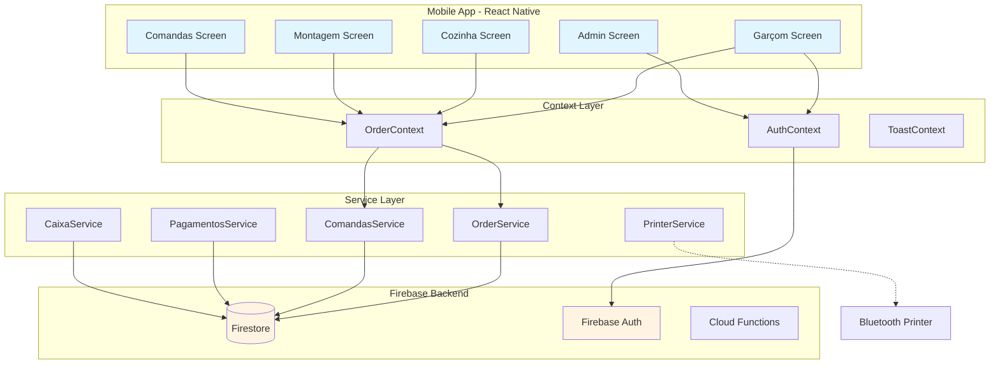

---

## 🔄 Fluxo de Criação de Pedido

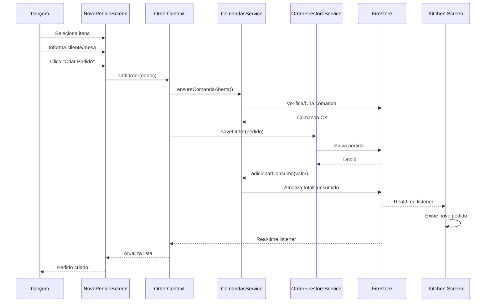

---

## 💰 Fluxo de Pagamento

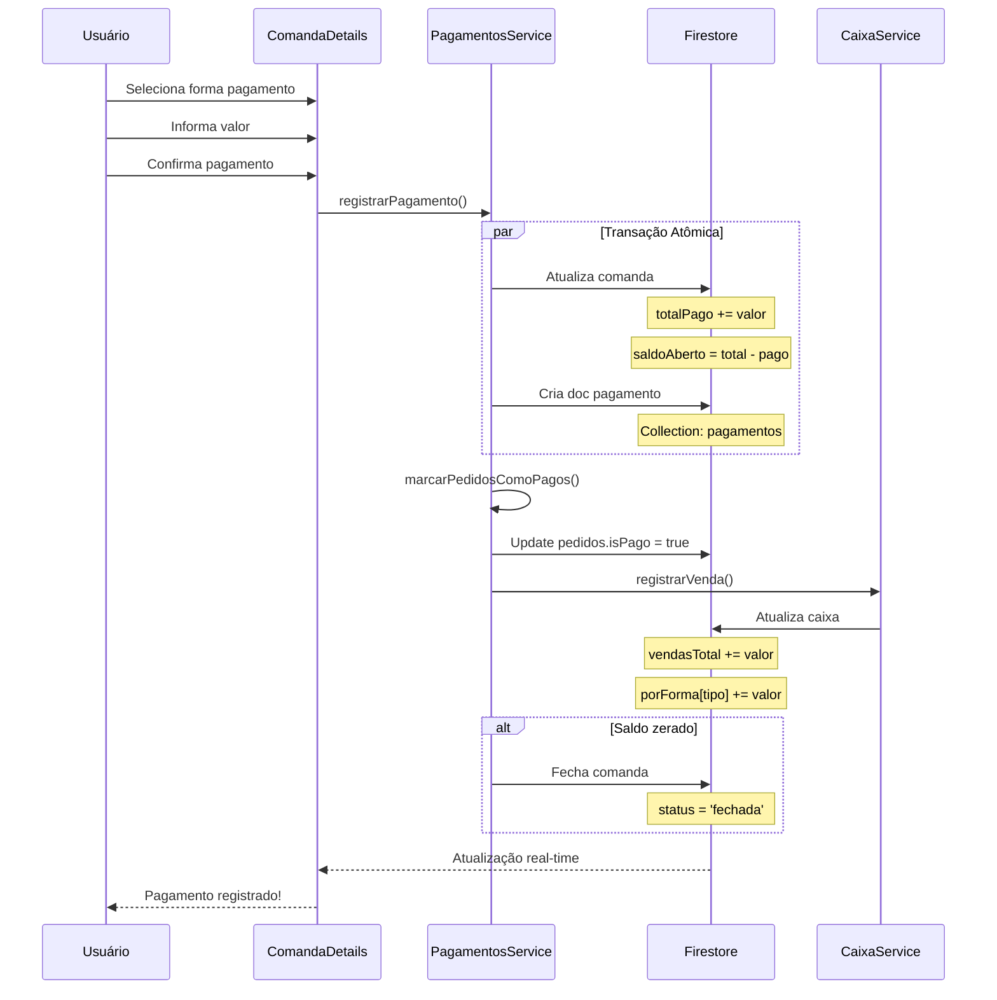

---

## 📦 Estrutura de Dados (Firestore)

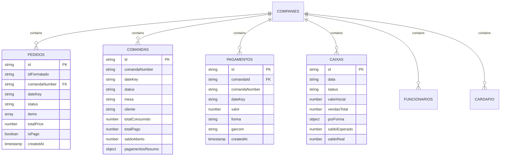

---

## 🔐 Sistema de Permissões

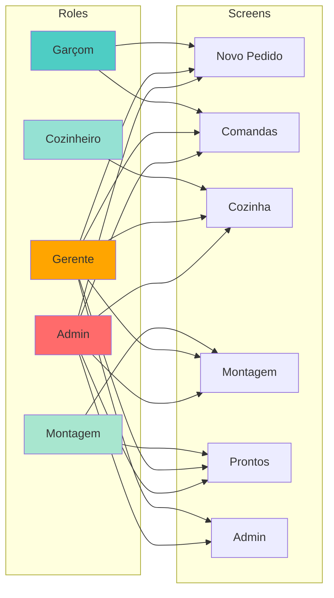

---

## 🔄 Ciclo de Vida do Pedido

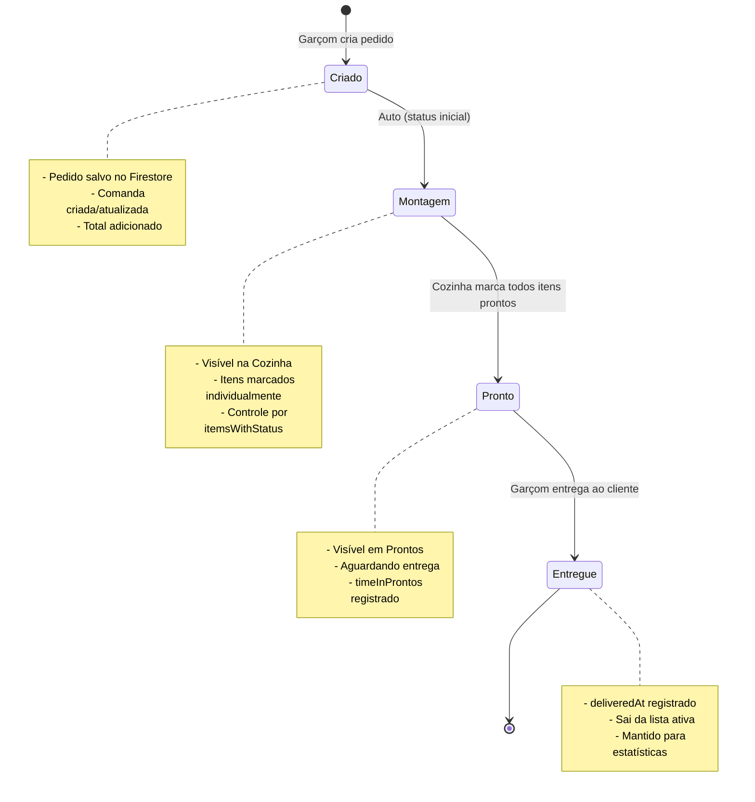

---

## 💳 Fluxo de Caixa Diário

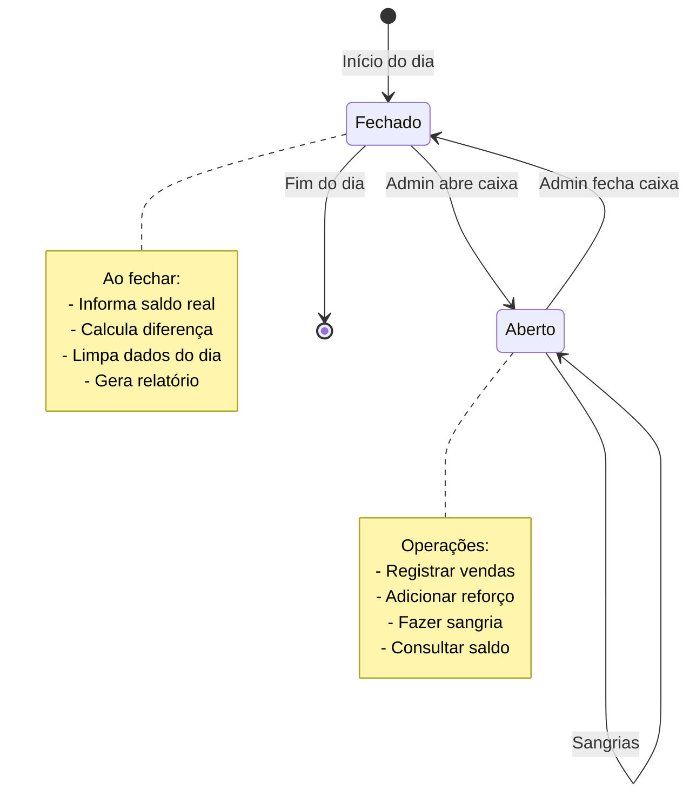

---

## 🏪 Arquitetura Multi-Tenancy

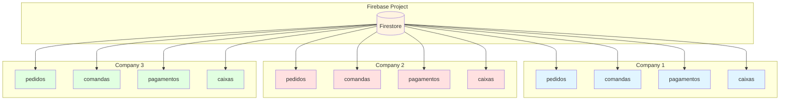

---

## 📊 Fluxo de Sincronização Real-Time

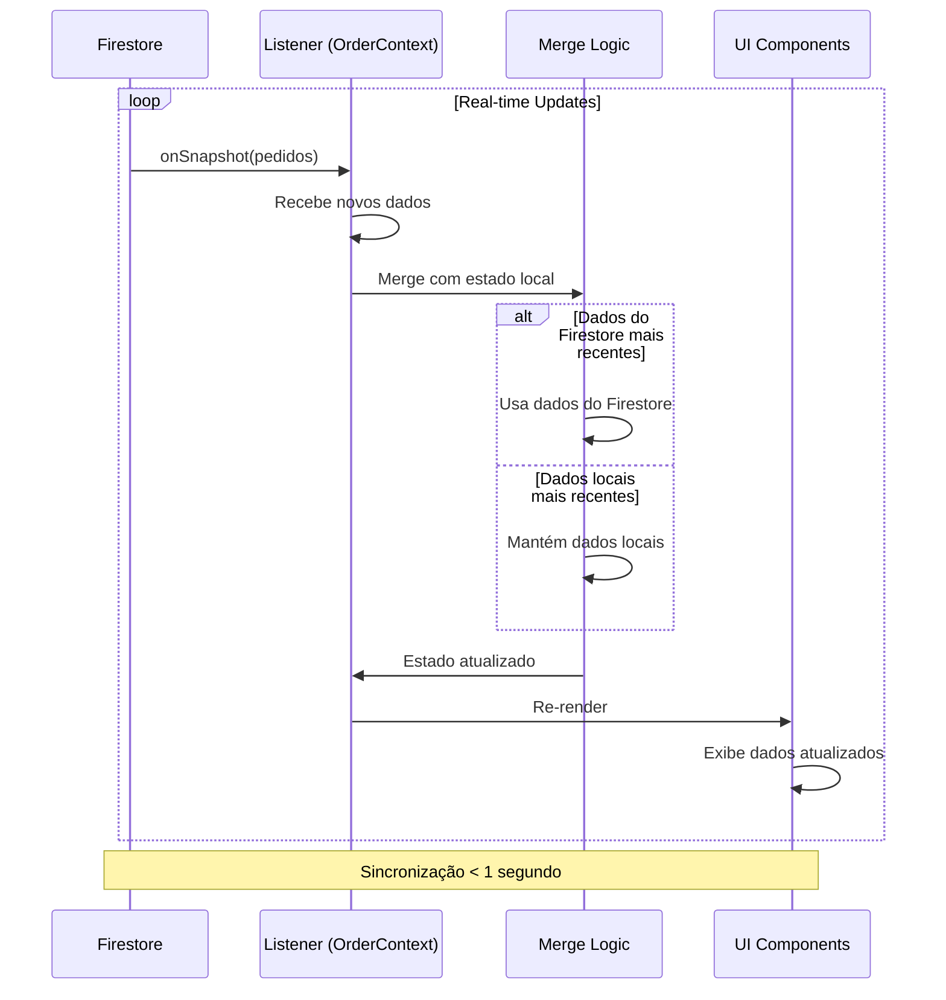

---

## 🔧 Arquitetura de Services

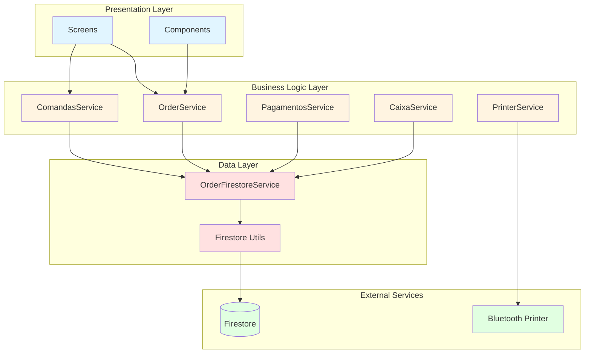

---

## 📱 Navegação do App

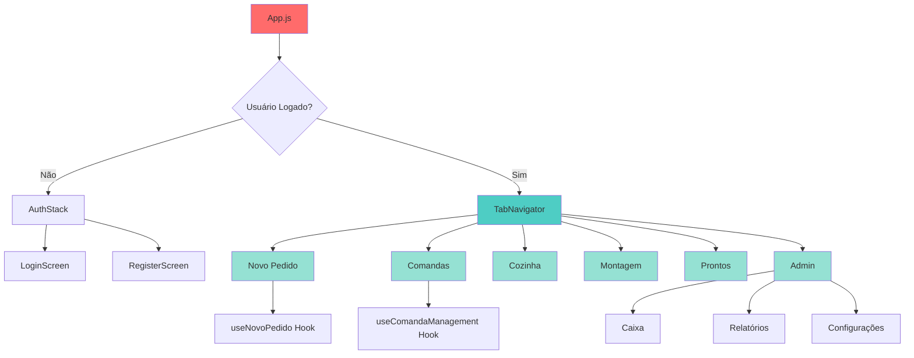

---

## 🎯 Conclusão

Estes diagramas fornecem uma visão visual clara da arquitetura do Restaurante App, facilitando o entendimento de:

- Estrutura geral do sistema
- Fluxos de dados
- Relacionamentos entre entidades
- Ciclos de vida
- Permissões e acessos

Para mais detalhes, consulte:
- [ANALISE_PROJETO.md](./ANALISE_PROJETO.md)
- [ANALISE_TECNICA_DETALHADA.md](./ANALISE_TECNICA_DETALHADA.md)

---

**Diagramas elaborados por:** Kiro AI  
**Data:** 31/01/2026
