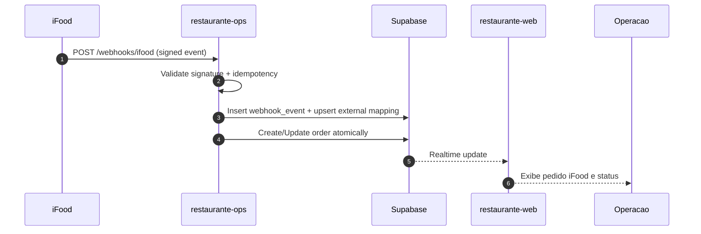

# Arquitetura da Integracao iFood

## 1. Contexto

Este documento define o desenho tecnico para integrar iFood ao ecossistema atual:

- `restaurante-web`: operacao e visualizacao
- `restaurante-ops`: entrada de webhooks e orquestracao
- Supabase: persistencia, RLS, realtime e auditoria

## 2. Fluxo atual (as-is)

1. Pedido delivery nasce manualmente no restaurante-web.
2. Pedido e persistido no Supabase (`orders`, `comandas`, `delivery_counters`).
3. Operacao avanca status ate entrega.
4. Eventos de status/pagamento podem acionar Activepieces.

## 3. Fluxo alvo (to-be)

1. iFood envia webhook de evento de pedido para `restaurante-ops`.
2. `restaurante-ops` valida assinatura, origem e idempotencia.
3. `restaurante-ops` resolve tenant (`company_id`) por credencial/config.
4. `restaurante-ops` grava evento e aplica mudanca atomica no Supabase.
5. `restaurante-web` recebe atualizacoes via realtime e exibe origem iFood.
6. Mudancas internas de status podem ser publicadas para iFood (fase posterior).

## 4. Componentes e responsabilidades

### restaurante-ops

- endpoint de webhook inbound iFood
- validacao de assinatura HMAC
- deduplicacao por `idempotency_key`
- orquestracao de escrita atomica no Supabase
- logs estruturados e metricas de integracao

### Supabase

- tabelas de mapeamento externo
- persistencia de eventos de webhook
- relacionamento `external_order_id` <-> pedido interno
- RLS por `company_id`

### restaurante-web

- identificacao visual de pedido originado em marketplace
- bloqueio de edicao em campos derivados do canal externo
- visibilidade de estado de sincronizacao do pedido

## 5. Diagrama de sequencia (visao alvo)

## 6. Decisoes arquiteturais

1. Nao integrar iFood direto no cliente web/app.
2. Centralizar inbound/outbound no `restaurante-ops`.
3. Evitar dependencia de processamentos no frontend para integridade.
4. Persistir todos os eventos relevantes para auditoria.

## 7. Riscos e mitigacoes

- Risco: webhook duplicado criar pedido duplicado.
- Mitigacao: chave de idempotencia + unique constraint.

- Risco: tenant incorreto por payload malicioso.
- Mitigacao: tenant resolvido por credencial/merchant vinculado, nao por campo livre.

- Risco: divergencia de status entre canais.
- Mitigacao: tabela de mapeamento de status + reconciliação periodica.

## 8. Dependencias para implementacao

- definicao final dos contratos oficiais do iFood (headers/eventos/retry)
- credenciais sandbox
- definicao de SLA operacional para sincronizacao
